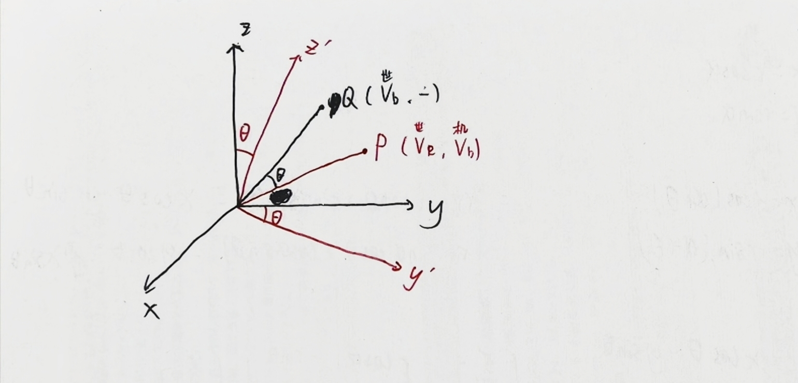
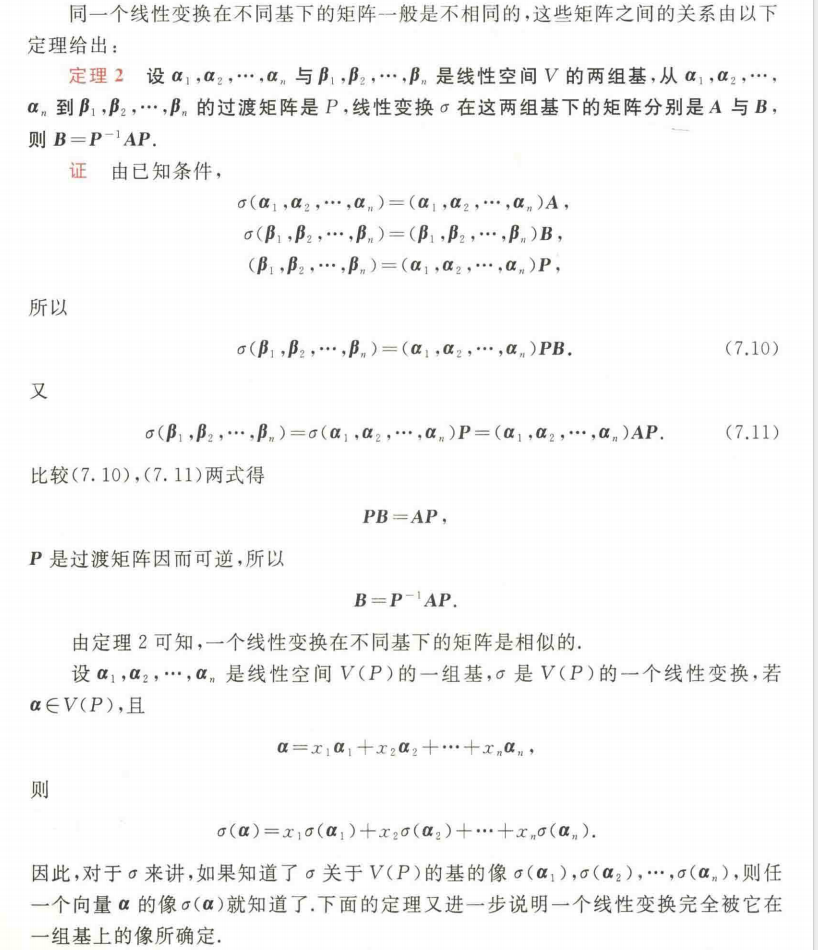

#### 前置知识

线性代数中**矩阵乘法**与**坐标变换**的核心概念：

1. **向量乘法顺序**：在三维空间中，用 $3 \times 1$ 的列向量 $P$ 表示一个点，旋转矩阵 $R$ 作用于点 $P$ 得到新位置 $P'$，写成 $P' = RP$。

2. **复合旋转**：如果先进行旋转 $A$，再进行旋转 $B$，那么新位置为 $P'' = B(AP) = (BA)P$。先发生的旋转写在右边，后发生的旋转写在左边。

3. **基底变换（相似变换）**[^证明]：如果矩阵 $R$ 表示在原坐标系下的旋转，而坐标系本身经过了变换 $M$，那么在**新坐标系下的旋转轴**，在原坐标系中对应的旋转矩阵为：

   $$R_{\text{new}} = M R M^{-1}$$

---

首先明确一下概念：

- $R_x, R_y, R_z$：基本旋转矩阵

  它们分别代表**绕固定世界坐标系的单个主轴（$X, Y, Z$ 轴）旋转指定角度**时所对应的 $3 \times 3$ 旋转矩阵。

- $R_{\text{外旋}}$：外旋复合矩阵

  几何含义：物体绕**固定的世界坐标系**（轴方向永远保持不变）依次进行多次旋转后，得到的总姿态复合矩阵。

- $R_{\text{内旋}}$：内旋复合矩阵

  几何含义：物体绕**自身当前的局部坐标系**（轴随物体一起转动）依次进行多次旋转后，得到的总姿态复合矩阵。

在ZYX顺序下的结论：

==$$R_{\text{外旋}} = R_x R_y R_z$$==

==$$R_{\text{内旋}} = R_z R_y R_x$$==

#### 一、 外旋：绕固定坐标系旋转

外旋指的是所有旋转轴都是**固定不动的世界坐标系 $O-XYZ$**。

假定旋转顺序为 **Z 轴 $\rightarrow$ Y 轴 $\rightarrow$ X轴**：

1. **第一步**：绕固定的 $Z$ 轴旋转，得到点 $P_1$：

   $$P_1=R_z P$$

2. **第二步**：绕固定的 $Y$ 轴旋转，得到点 $P_2$：

   $$P_2 = R_y P_1 = R_y (R_z P) = (R_y R_z) P$$

3. **第三步**：绕固定的 $X$ 轴旋转，得到点 $P_3$：

   $$P_3 = R_x P_2 = R_x (R_y R_z P) = (R_x R_y R_z) P$$

**外旋总变换矩阵**为：

$$R_{\text{extrinsic}} = R_x R_y R_z$$

> 因为坐标轴不动，后施加的旋转直接乘以最左侧即可。
>
> 实际传感器测出的是机体坐标系下的向量，所以实际原理要比上述稍复杂。上课有讲。

补充：传感器测得的向量 $P$ 是在**机体坐标系**下的向量。

坐标系转换：$$b \rightarrow e : C_b^e = R_z R_y R_x， $$

$$e \rightarrow b  : C_e^b = R_z R_y R_x$$

#### 二、内旋：绕动坐标系旋转

内旋指的是每一次旋转，都是绕**物体自身当前的局部坐标系**进行的。

假定旋转顺序为 **Z 轴 $\rightarrow$ Y' 轴 $\rightarrow$ X'' 轴**：

##### 1. 第一次旋转：绕初始 $Z$ 轴

初始时，假设物体坐标系与世界坐标系重合。

- 绕 $Z$ 轴旋转，矩阵直接为 $R_z$。

- 此时，物体的坐标系从 $(X, Y, Z)$ 变成了 $(X', Y', Z')$。

- 这个变换的复合旋转矩阵为：

  $$M_1 = R_z$$

##### 2. 第二次旋转：绕新的 $Y'$ 轴

此时要绕**刚刚转过去的 $Y'$ 轴**旋转。

- 在原固定坐标系看来， $Y'$ 轴是 $Y$ 轴经过 $M_1$（即 $R_z$）变换后的结果。

- 根据相似变换公式 $R_{\text{new}} = M R M^{-1}$，绕新 $Y'$ 轴旋转在固定坐标系下的表示为：

  $$R_{y'} = M_1 R_y M_1^{-1} = R_z R_y R_z^{-1}$$

- 现在计算两次旋转叠加后的总变换 $M_2$（即后发生的旋转 $R_{y'}$ 乘以之前的旋转 $M_1$）：

  $$M_2 = R_{y'} \cdot M_1 = (R_z R_y R_z^{-1}) \cdot R_z$$

  利用结合律，注意到中间的 $R_z^{-1} R_z = I$：

  $$M_2 = R_z R_y (R_z^{-1} R_z) = R_z R_y$$

##### 3. 第三次旋转：绕最新的 $X''$ 轴

此时要绕**经过两次旋转后的 $X''$ 轴**旋转。

- 在原固定坐标系看来，$X''$ 轴是初始 $X$ 轴经过前两次总变换 $M_2$（即 $R_z R_y$）之后的结果。

- 再次运用相似变换公式，绕新 $X''$ 轴的旋转在固定坐标系下的表示为：

  $$R_{x''} = M_2 R_x M_2^{-1} = (R_z R_y) R_x (R_z R_y)^{-1}$$

- 计算三次旋转叠加后的最终总变换 $R_{\text{intrinsic}}$：

  $$R_{\text{intrinsic}} = R_{x''} \cdot M_2 = \left((R_z R_y) R_x (R_z R_y)^{-1}\right) \cdot (R_z R_y)$$

  同样相消，右侧的 $(R_z R_y)^{-1} (R_z R_y) = I$：

  $$R_{\text{intrinsic}} = (R_z R_y) R_x \cdot I = R_z R_y R_x$$

**内旋总变换矩阵**为：

$$R_{\text{intrinsic}} = R_z R_y R_x$$

> 26.09.03课前整理

#### 三、机体系与地球系间的变换

以上是从数学角度推导的，那么在实际中我们如何去理解呢？

我们实际测得的是机体坐标系下的向量 $V_b$，如何将其转换成世界坐标系下的向量 $V_e$？

一开始是世界坐标系（黑），绕 X 轴顺时针旋转 $\theta$ 后得到机体坐标系（红）。这个过程产生旋转矩阵 $R_x$。

我们取机体坐标系下测得的向量P（红），它在**机体坐标系**下表示成 $V_b$，我们想要知道如何转换成它在**世界坐标系**下的表示 $V_e$。

不妨想象，在世界坐标系下，存在着一个“相对位置”一致的向量Q（黑），也就是说Q在**世界坐标系**下也表示成 $V_b$。那么在一开始世界坐标系转动的过程中，带着Q一起转动，转动 $\theta$ 后，Q便与P重合了。

所以，**P相当于是Q顺时针旋转 $\theta$ 后得到的**。由于顺时针旋转 $\theta$ 对应旋转矩阵 $R_x$，故：$$P = R_x Q$$

我们希望得到的 $V_e$ 是世界坐标系下的，Q在世界坐标系下可以表示成 $V_b$，因此我们此时只看世界坐标系下的PQ，便能得到：$V_e = R_x V_b$

同理继续运算，便可以得出机体坐标系b到地球坐标系的转换：$V_e = R_z R_y R_x V_b$

这样我们便完成了，如何拿着传感器实际测得的向量 $V_b$ 和欧拉角，转换出机体在世界坐标系下的实际向量。

> 26.09.03课后整理

---

[^证明]: 参考《线性代数与空间解析几何（第五版）》 240页定理2   