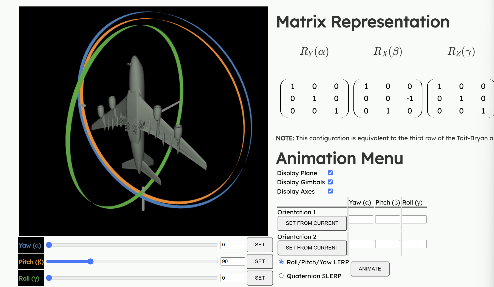

### 参考系

- 右/左手系

- 地球系
- 机体系

- 外旋：绕地球系，固定轴
- 内旋：绕机体轴，动轴

### 欧拉角与万向锁

欧拉角：

- 绕Z：偏航角 Yaw（$\psi$）
- 绕Y：俯仰角 Pitch（$\theta$）
- 绕X：横滚角 Roll（$\phi$）

欧拉角的描述，是要遵守坐标轴的顺序的。绕着xyz坐标轴顺序旋转，和绕着yzx坐标轴顺序旋转，度数相同得到的结果是不一样的。这与矩阵乘法的不可交换性有关。

> 什么是万向锁？

[演示demo](https://ursinusgraphics.github.io/RollPitchYaw/)

在这个Yaw/Pitch/Roll Gimbal Visualization模型中，我们调节pitch至90°，然后试着调整yaw和roll，会看到飞机的旋转方向一致，调节不同欧拉角带来的结果是等价的。而我们希望的则是调整三个欧拉角中的任意一个，都能对飞机进行不同的姿态调节（也就是三个自由度）。

这意味着少了一个自由度，缺了一个轴方向上的改变，飞机的活动受到了限制。这就是**万向锁**。

事实上，只有当pitch角旋转至90°（或270°）时，才会发生这种现象。

> 为什么？

我们前面提到，欧拉角是要约定严格的变换顺序的。这个模型实际上固定了ZYX的变换顺序。

我们可以发现，依次调节yaw, pitch, roll, 飞机每一次是**绕自身参考系下的坐标轴**旋转的（内旋）。如果不按这个顺序调节，则不会如上所述。另一方面，我们也可以发现，调节yaw时，pitch和roll绕的轴也会发生变化；而调节低级的pitch/roll时，不会影响之后调节yaw时所绕的轴。这是一个大圈带动小圈的过程，Z会带动YX，Y会带动X。

对于某一种固定的顺序，只有绕中间顺序（比如ZYX中的Y，XZY中的Z）的轴旋转至90°（或270°）时，才会出现万向锁。

**欧拉角关注的是姿态变换的结果，而非运动过程。**

也可以看看这篇文章：[为什么欧拉角会出现万向锁现象？ - 知乎](https://zhuanlan.zhihu.com/p/1941153035284907906)

> 如何解决万向锁问题？

需要从欧拉角转向四元数。我们日后再来做这项工作。