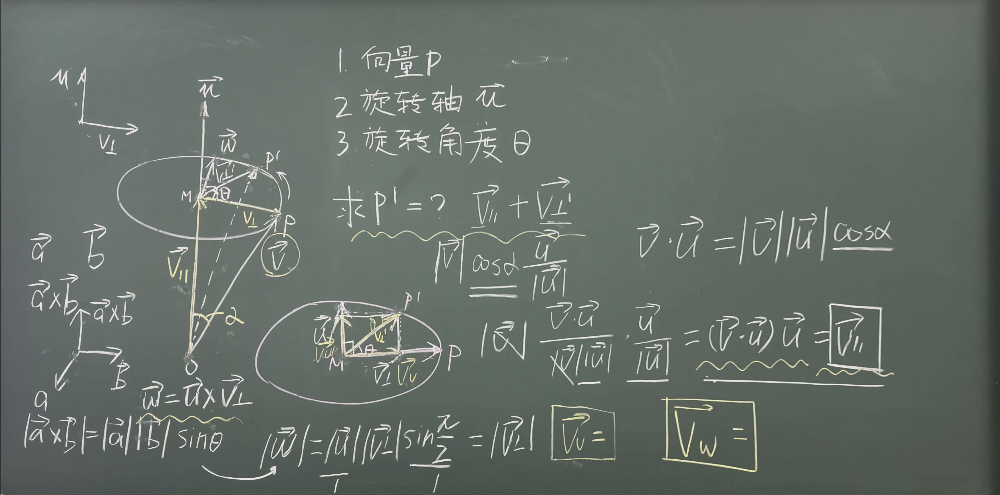
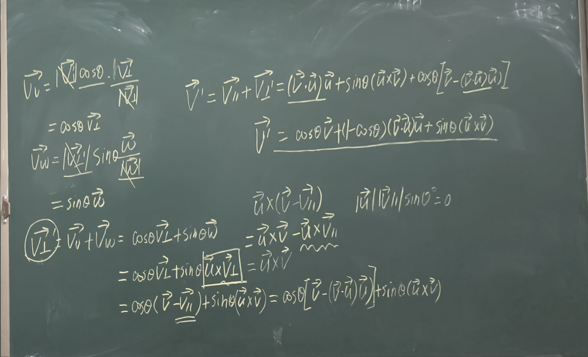

### 轴角法

我们已知 $P$ 求 $P'$，就相当于已知 $\vec{OP}$，要求 $\vec{OP}'$。

$$\vec{OP} = \vec{v}_{\parallel} + \vec{v}_{\perp}$$

$$\vec{v}_{\parallel} = |\vec{v}|\cos\alpha \cdot \frac{\vec{u}}{|\vec{u}|} \quad（\vec{u} 为单位向量）$$

$$\cos\alpha = \frac{\vec{v} \cdot \vec{u}}{|\vec{v}||\vec{u}|}$$

故 $$\vec{v}_{\parallel} = (\vec{v} \cdot \vec{u})\vec{u}$$

构造向量 $\vec{\omega}$，$$\vec{\omega} = \vec{u} \times \vec{v}_{\perp}$$

$$|\vec{\omega}| = |\vec{u}||\vec{v}_{\perp}|\sin\frac{\pi}{2} = |\vec{v}_{\perp}|$$

通过几何知识可知 $\vec{\omega}$ 在圆平面内

将 $\vec{v}_{\perp}'$ 在 $\vec{v}_{\perp}$ 和 $\vec{\omega}$ 上分解成两个向量 $\vec{v}_v$ 和 $\vec{v}_w$

$$\vec{v}_v = |\vec{v}_{\perp}'|\cos\theta \cdot \frac{\vec{v}_{\perp}}{|\vec{v}_{\perp}|} = \cos\theta\,\vec{v}_{\perp}$$

同理 $$\vec{v}_w = \sin\theta\,\vec{\omega}$$

所以：$$\vec{v}_{\perp}' = \vec{v}_v + \vec{v}_w = \cos\theta\,\vec{v}_{\perp} + \sin\theta\,\vec{\omega}$$

$$= \cos\theta\,\vec{v}_{\perp} + \sin\theta(\vec{u} \times \vec{v}_{\perp}) = \cos\theta(\vec{v} - \vec{v}_{\parallel}) + \sin\theta(\vec{u} \times (\vec{v} - \vec{v}_{\parallel}))$$

$$= \cos\theta(\vec{v} - \vec{v}_{\parallel}) + \sin\theta(\vec{u} \times \vec{v}) = \cos\theta(\vec{v} - (\vec{v} \cdot \vec{u})\vec{u}) + \sin\theta(\vec{u} \times \vec{v})$$

所以：$$\vec{v}' = \vec{v}_{\parallel} + \vec{v}_{\perp}' = (\vec{v} \cdot \vec{u})\vec{u} + \cos\theta(\vec{v} - (\vec{v} \cdot \vec{u})\vec{u}) + \sin\theta(\vec{u} \times \vec{v})$$

$$= \cos\theta\,\vec{v} + (1 - \cos\theta)(\vec{v} \cdot \vec{u})\vec{u} + \sin\theta(\vec{u} \times \vec{v})$$

这是罗德里格斯旋转公式。

轴角法存在一些问题。首先是奇点，旋转0°时旋转轴不确定。然后是插值困难。

> 26.09.08课后
