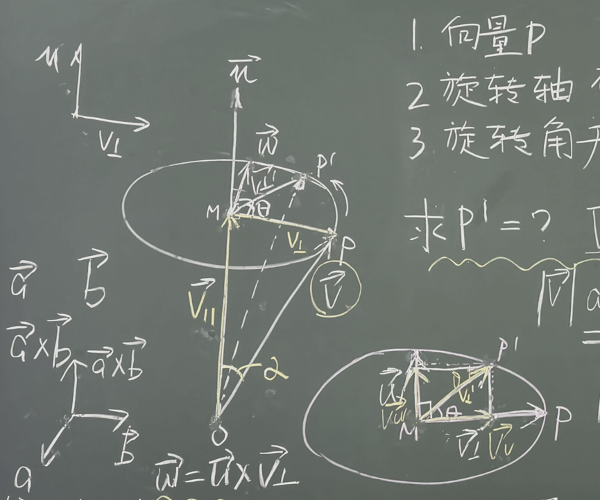
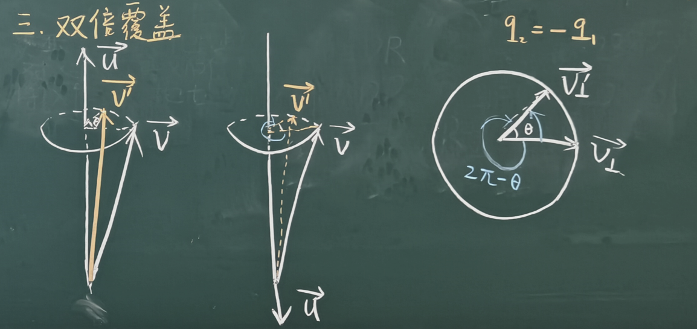

# 三维空间旋转与四元数推导

---

@ Huizhong Yang

## 一、 2D 空间旋转的代数表示与演化

首先回顾二维空间中旋转的三种代数表示形式及其复合性质.

### 1.1 2D 旋转矩阵形式

平面向量 $v = \begin{pmatrix} x \\ y \end{pmatrix}$ 绕原点逆时针旋转 $\theta$ 角后的新向量 $v'$，可由 2D 旋转矩阵表示：

$$v' = \begin{pmatrix} \cos\theta & -\sin\theta \\ \sin\theta & \cos\theta \end{pmatrix} v$$

### 1.2 旋转的复数积形式与欧拉公式推导

利用复数平面，将二维向量表示为复数 $v = x + yi$。旋转操作可以等价表达为与复数 $(\cos\theta + i\sin\theta)$ 相乘：

$$v' = (\cos\theta + i\sin\theta) v$$

进一步利用泰勒级数展开证明欧拉公式 $\cos\theta + i\sin\theta = e^{i\theta}$：

1. **纯虚数的指数展开**：

   $$e^{i\theta} = 1 + i\theta + \frac{(i\theta)^2}{2!} + \frac{(i\theta)^3}{3!} + \dots + \frac{(i\theta)^n}{n!}$$

2. **利用 $i^2 = -1, i^3 = -i, i^4 = 1$ 分离实部与虚部**：

   $$e^{i\theta} = \left[ 1 - \frac{\theta^2}{2!} + \frac{\theta^4}{4!} - \dots + \frac{(-1)^n \theta^{2n}}{(2n)!} \right] + i \left[ \theta - \frac{\theta^3}{3!} + \frac{\theta^5}{5!} - \dots + \frac{(-1)^{n+1} \theta^{2n+1}}{(2n+1)!} \right]$$

3. **结合余弦与正弦的泰勒级数**：

   $$e^{i\theta} = \cos\theta + i\sin\theta \implies i\theta = \ln(\cos\theta + i\sin\theta)$$

### 1.3 旋转的指数形式

基于欧拉公式，二维旋转可极为简洁地写作：

$$v' = e^{i\theta} v$$

### 1.4 2D 旋转的复合性（交换律）

连续进行两次旋转 $\theta$ 与 $\phi$：

- 顺序一：先转 $\theta$ 再转 $\phi \implies v'' = e^{i\phi}(e^{i\theta} v) = e^{i(\phi + \theta)} v$
- 顺序二：先转 $\phi$ 再转 $\theta \implies v'' = e^{i\theta}(e^{i\phi} v) = e^{i(\theta + \phi)} v$

因为复数乘法满足交换律（$\theta + \phi = \phi + \theta$），**二维旋转的复合是可交换的**。

## 二、 3D 旋转与四元数的引入

将二维乘法旋转推广到三维空间时，首先需要对三维向量进行分解：任意向量 $\vec{v}$ 绕单位轴 $\vec{u}$（$\|\vec{u}\| = 1$）旋转 $\theta$ 角。

将向量 $\vec{v}$ 分解为沿旋转轴平行分量 $\vec{v}_\parallel$ 与垂直于旋转轴的分量 $\vec{v}_\perp$：

$$\vec{v} = \vec{v}_\perp + \vec{v}_\parallel$$

根据几何直观，旋转后新向量 $\vec{v}'$ 也对应分解为：

$$\vec{v}' = \vec{v}_\perp' + \vec{v}_\parallel'$$

## 三、 垂直分量 $\vec{v}_\perp$ 的旋转推导

### 3.1 罗德里格旋转公式的几何构建

在之前轴角法的学习中，我们得出，$\vec{v}_\perp'$ 可写为：

$$
\vec{v}_\perp' = \cos\theta \cdot \vec{v}_\perp + \sin\theta (\vec{u} \times \vec{v}_\perp) \quad \tag{1}
$$

### 3.2 构造纯四元数表达

将三维向量嵌入纯四元数空间（实部为 0）：

- 旋转轴纯四元数：$u = [0, \vec{u}]$
- 垂直分量纯四元数：$v_\perp = [0, \vec{v}_\perp]$
- 旋转后垂直分量纯四元数：$v_\perp' = [0, \vec{v}_\perp']$

根据四元数格拉斯曼积：

$$u v_\perp = [0, \vec{u}][0, \vec{v}_\perp] = [-\vec{u} \cdot \vec{v}_\perp, \; \vec{u} \times \vec{v}_\perp]$$

因为 $\vec{u} \perp \vec{v}_\perp$，所以点积 $\vec{u} \cdot \vec{v}_\perp = 0$，故：

$$u v_\perp = [0, \vec{u} \times \vec{v}_\perp] \implies u v_\perp \equiv \vec{u} \times \vec{v}_\perp$$

### 3.3 导出四元数乘积形式

将 $u v_\perp$ 代入公式 (1)，改写为四元数运算：

$$
v_\perp' = \cos\theta v_\perp + \sin\theta (u v_\perp) = (\cos\theta + \sin\theta u) v_\perp \quad \tag{2}
$$
定义旋转四元数 $q = \cos\theta + \sin\theta u$，则垂直分量的旋转写为：

$$
v_\perp' = q v_\perp \quad \tag{3}
$$

## 四、 旋转四元数的性质与平行分量处理

### 4.1 旋转四元数 $q$ 的代数性质

对于 $q = \cos\theta + \sin\theta u$（其中 $u$ 为单位纯四元数 $\|\vec{u}\| = 1$）：

1. **模长为 1（单位四元数）**：

   $$\|q\| = \sqrt{\cos^2\theta + \sin^2\theta \|\vec{u}\|^2} = \sqrt{\cos^2\theta + \sin^2\theta} = 1$$

2. **共轭与逆相等**：

   $$q^* = \cos\theta - \sin\theta u$$

   $$q^{-1} = \frac{q^*}{\|q\|^2} = q^* \quad \tag{4}$$

### 4.2 平行分量 $\vec{v}_\parallel$ 的旋转

平行于旋转轴的向量在旋转过程中保持不变：

$$\vec{v}_\parallel' = \vec{v}_\parallel \implies v_\parallel' = v_\parallel \quad \tag{5}$$

## 五、 全向量 $\vec{v}$ 的旋转与“半角化”推导

### 5.1 初步叠加的问题

结合垂直与平行分量的旋转：

$$v' = v_\perp' + v_\parallel' = q v_\perp + v_\parallel \quad \tag{6}$$

由于 $v_\parallel$ 没有乘以 $q$，无法直接提取公因式 $q$。

为了统一表达，**利用 $p p^{-1} = 1$**，将 $v_\parallel$ 变形为：

$$
v' = q v_\perp + p p^{-1} v_\parallel \quad \tag{4}
$$
这里的 $p$ 我们暂时没有赋值，任意的 $p$ 都满足 $p p^{-1} = 1$ 。然而，这种形式两侧不对称。为了寻求形式对称且无歧义的表达式，我们引入了**角度半角拆分**。

### 5.2 引理 1：半角四元数的平方（p 与 q 的关系）

将角度拆分为 $\theta = \frac{\theta}{2} + \frac{\theta}{2}$，构造半角单位四元数 $p$：

$$p = \cos\frac{\theta}{2} + \sin\frac{\theta}{2} u = \left[ \cos\frac{\theta}{2}, \; \sin\frac{\theta}{2} \vec{u} \right]$$

**引理 1 内容**：若 $p = \left[ \cos\frac{\theta}{2}, \; \sin\frac{\theta}{2}\vec{u} \right]$ 且 $\|\vec{u}\| = 1$，则 $q = p \cdot p = [\cos\theta, \; \sin\theta \vec{u}]$。

> **证明**：
>
> 利用格拉斯曼积展开 $p \cdot p$：
>
> $$\begin{aligned} p \cdot p &= \left[ \cos^2\frac{\theta}{2} - \sin^2\frac{\theta}{2} (\vec{u} \cdot \vec{u}), \; 2 \sin\frac{\theta}{2} \cos\frac{\theta}{2} \vec{u} + \sin^2\frac{\theta}{2} (\vec{u} \times \vec{u}) \right] \end{aligned}$$
>
> 由于 $\|\vec{u}\| = 1 \implies \vec{u} \cdot \vec{u} = 1$，且向量与自身的叉积 $\vec{u} \times \vec{u} = \vec{0}$：
>
> $$p \cdot p = \left[ \cos^2\frac{\theta}{2} - \sin^2\frac{\theta}{2}, \; (2\sin\frac{\theta}{2}\cos\frac{\theta}{2}) \vec{u} \right] = [\cos\theta, \; \sin\theta \vec{u}] = q$$
>
> 证毕。

### 5.3 替换与推导三维夹心乘积

将 $q = p p$ 代入公式 (5)：

$$
v' = p p v_\perp + p p^{-1} v_\parallel = p \left( p v_\perp + p^{-1} v_\parallel \right) \quad \tag{6}
$$
下面分析 $p v_\perp$ 和 $v_\perp p^*$ 的关系：

- $p = \left[ \cos\frac{\theta}{2}, \; \sin\frac{\theta}{2}\vec{u} \right]$，$p^* = p^{-1} = \left[ \cos\frac{\theta}{2}, \; -\sin\frac{\theta}{2}\vec{u} \right]$

- $v_\perp = [0, \vec{v}_\perp]$，由于 $\vec{u} \cdot \vec{v}_\perp = 0$：

  $$p v_\perp = \left[ -\sin\frac{\theta}{2} (\vec{u} \cdot \vec{v}_\perp), \; \cos\frac{\theta}{2}\vec{v}_\perp + \sin\frac{\theta}{2} (\vec{u} \times \vec{v}_\perp) \right] = \left[ 0, \; \cos\frac{\theta}{2}\vec{v}_\perp + \sin\frac{\theta}{2} (\vec{u} \times \vec{v}_\perp) \right]$$

  而计算 $v_\perp p^{-1}$：

  $$v_\perp p^{-1} = \left[ \sin\frac{\theta}{2} (\vec{v}_\perp \cdot \vec{u}), \; \cos\frac{\theta}{2}\vec{v}_\perp - \sin\frac{\theta}{2} (\vec{v}_\perp \times (-\vec{u})) \right] = \left[ 0, \; \cos\frac{\theta}{2}\vec{v}_\perp + \sin\frac{\theta}{2} (\vec{u} \times \vec{v}_\perp) \right]$$

  因此得出重要交换关系：

  ==$$p v_\perp = v_\perp p^{-1}$$==

同理分析平行分量 $v_\parallel = [0, \vec{v}_\parallel]$，因为 $\vec{u} \parallel \vec{v}_\parallel \implies \vec{u} \times \vec{v}_\parallel = \vec{0}$：

$$p^{-1} v_\parallel = \left[ \sin\frac{\theta}{2} (\vec{u} \cdot \vec{v}_\parallel), \; \cos\frac{\theta}{2} \vec{v}_\parallel \right] = v_\parallel p^{-1}$$

所以可知平行分量满足 ==$p^{-1} v_\parallel = v_\parallel p^{-1}$==。

最终将垂直与平行分量两个满足的条件带入公式 (6)，

导出了三维空间四元数旋转的最终**双边夹心乘积公式**：$$v' = p \left( p v_\perp + p^{-1} v_\parallel \right) = p( v_\perp p^{-1} +  v_\parallel p^{-1}) = p(v_\perp + v_\parallel)p^{-1} = pvp^{-1}$$
$$
\mathbf{v' = p v p^*} \quad \text{或} \quad \mathbf{v' = p v p^{-1}}	\tag{7}
$$
其中 $p = \left[ \cos\frac{\theta}{2}, \; \sin\frac{\theta}{2}\vec{u} \right]$ 即为对应的**单位旋转四元数**。

> 26.09.14课后整理

## 六、 罗德里格斯旋转公式与四元数展开证明

在前我们推导出了四元数三维旋转的**双边夹心乘积公式**：
$$
V' = q V q^{-1} \quad \left(q = \left[\cos\frac{\theta}{2}, \; \sin\frac{\theta}{2}\vec{u}\right], \; V = [0, \vec{v}], \; q^{-1} = q^* = \left[\cos\frac{\theta}{2}, \; -\sin\frac{\theta}{2}\vec{u}\right]\right)
$$
本节课将直接通过四元数格拉斯曼积计算 $q V q^*$，严格证明其虚部精准对应三维空间中经典的**罗德里格斯旋转公式**（该公式见轴角法.md）：
$$
\vec{v}' = \cos\theta \cdot \vec{v} + (1 - \cos\theta)(\vec{u}\cdot\vec{v})\vec{u} + \sin\theta (\vec{u}\times\vec{v})
$$

### 6.1 第一步：计算左乘 $q V$

已知 $q = \left[\cos\frac{\theta}{2}, \; \sin\frac{\theta}{2}\vec{u}\right]$，纯四元数 $V = [0, \vec{v}]$。

根据四元数乘法定义 $q_1 q_2 = [s t - \vec{v}_1\cdot\vec{v}_2, \; s\vec{v}_2 + t\vec{v}_1 + \vec{v}_1\times\vec{v}_2]$：

$$q V = \left[ -\sin\frac{\theta}{2} (\vec{u}\cdot\vec{v}), \; \cos\frac{\theta}{2}\vec{v} + \sin\frac{\theta}{2} (\vec{u}\times\vec{v}) \right]$$

### 6.2 第二步：计算夹心积 $q V q^{-1}$ 的实部与虚部

设 $q V = [s', \vec{v}']$，其中 $s' = -\sin\frac{\theta}{2}(\vec{u}\cdot\vec{v})$，$\vec{v}' = \cos\frac{\theta}{2}\vec{v} + \sin\frac{\theta}{2}(\vec{u}\times\vec{v})$；

再右乘 $q^{-1} = \left[\cos\frac{\theta}{2}, \; -\sin\frac{\theta}{2}\vec{u}\right] = [t, \vec{w}]$（这里 $t = \cos\frac{\theta}{2}$，$\vec{w} = -\sin\frac{\theta}{2}\vec{u}$）。

#### 1. 实部计算

$$\text{实部} = s' t - \vec{v}' \cdot \vec{w}$$

代入具体项：

$$\text{实部} = -\sin\frac{\theta}{2}\cos\frac{\theta}{2}(\vec{u}\cdot\vec{v}) - \left( -\sin\frac{\theta}{2}\vec{u} \right) \cdot \left( \cos\frac{\theta}{2}\vec{v} + \sin\frac{\theta}{2}(\vec{u}\times\vec{v}) \right)$$

利用点积的分配律展开：

$$\text{实部} = -\sin\frac{\theta}{2}\cos\frac{\theta}{2}(\vec{u}\cdot\vec{v}) + \sin\frac{\theta}{2}\cos\frac{\theta}{2}(\vec{u}\cdot\vec{v}) + \sin^2\frac{\theta}{2}\vec{u}\cdot(\vec{u}\times\vec{v})$$

前两项相互抵消，第三项中由于叉积向量 $\vec{u}\times\vec{v}$ 恒垂直于 $\vec{u}$，故其点积 $\vec{u}\cdot(\vec{u}\times\vec{v}) = 0$：

$$\text{实部} = 0$$

这证明了旋转后的四元数 $V'$ 仍然是一个**纯四元数**（实部为 0）。

#### 2. 虚部计算（Vector Part）

$$\text{虚部} = s' \vec{w} + t \vec{v}' + \vec{v}' \times \vec{w}$$

代入具体项：

$$\begin{aligned} \text{虚部} = &\; \cos\frac{\theta}{2}\left( \cos\frac{\theta}{2}\vec{v} + \sin\frac{\theta}{2}\vec{u}\times\vec{v} \right) + \sin\frac{\theta}{2}(\vec{u}\cdot\vec{v})\vec{u} \\ &+ \left(-\sin\frac{\theta}{2}\vec{u}\right) \times \left( \cos\frac{\theta}{2}\vec{v} + \sin\frac{\theta}{2}\vec{u}\times\vec{v} \right) \end{aligned}$$

展开叉积与各项：

$$\begin{aligned} \text{虚部} = &\; \cos^2\frac{\theta}{2}\vec{v} + \sin\frac{\theta}{2}\cos\frac{\theta}{2}(\vec{u}\times\vec{v}) + \sin^2\frac{\theta}{2}(\vec{u}\cdot\vec{v})\vec{u} \\ &+ \sin\frac{\theta}{2}\cos\frac{\theta}{2}(\vec{u}\times\vec{v}) + \sin^2\frac{\theta}{2} \left[ \vec{u} \times (\vec{u} \times \vec{v}) \right] \\= &\; \cos^2\frac{\theta}{2}\vec{v} + 2\sin\frac{\theta}{2}\cos\frac{\theta}{2}(\vec{u}\times\vec{v}) + \sin^2\frac{\theta}{2}(\vec{u}\cdot\vec{v})\vec{u} + \sin^2\frac{\theta}{2}\left[ (\vec{u}\cdot\vec{v})\vec{u} - \vec{v} \right] \\ = &\; \left( \cos^2\frac{\theta}{2} - \sin^2\frac{\theta}{2} \right)\vec{v} + 2\sin^2\frac{\theta}{2}(\vec{u}\cdot\vec{v})\vec{u} + 2\sin\frac{\theta}{2}\cos\frac{\theta}{2}(\vec{u}\times\vec{v}) \end{aligned}$$

> 这里遇到了矢量三重积项：$\vec{u} \times (\vec{u} \times \vec{v})$。
>
> **矢量三重积展开公式**：
>
> $$\vec{a}\times(\vec{b}\times\vec{c}) = (\vec{a}\cdot\vec{c})\vec{b} - (\vec{a}\cdot\vec{b})\vec{c}$$
>
> #### 几何几何逻辑推导：
>
> 1. **垂直关系**：$\vec{a}\times(\vec{b}\times\vec{c}) \perp \vec{a}$，且 $\vec{a}\times(\vec{b}\times\vec{c}) \perp (\vec{b}\times\vec{c})$。
> 2. **共面性**：因为该向量垂直于 $\vec{b}\times\vec{c}$ 的法线方向，故它必位于由向量 $\vec{b}$ 与 $\vec{c}$ 张成的平面内。
> 3. **线性组合表达**：可设 $\vec{a}\times(\vec{b}\times\vec{c}) = \lambda \vec{b} + \mu \vec{c}$。带入标量条件可解得 $\lambda = \vec{a}\cdot\vec{c}$，$\mu = -(\vec{a}\cdot\vec{b})$。
>
> #### 应用到本题：
>
> 将 $\vec{a} = \vec{u}, \; \vec{b} = \vec{u}, \; \vec{c} = \vec{v}$ 代入矢量三重积公式：
>
> $$\vec{u}\times(\vec{u}\times\vec{v}) = (\vec{u}\cdot\vec{v})\vec{u} - (\vec{u}\cdot\vec{u})\vec{v}$$
>
> 因为 $\vec{u}$ 为单位向量，即 $\|\vec{u}\| = 1 \implies \vec{u}\cdot\vec{u} = 1$，故：
>
> $$\underline{\vec{u}\times(\vec{u}\times\vec{v}) = (\vec{u}\cdot\vec{v})\vec{u} - \vec{v}}$$

利用三角函数的**倍角与半角恒等式**：

- $\cos^2\frac{\theta}{2} - \sin^2\frac{\theta}{2} = \cos\theta$
- $2\sin^2\frac{\theta}{2} = 1 - \cos\theta$
- $2\sin\frac{\theta}{2}\cos\frac{\theta}{2} = \sin\theta$

代入上式，最终得到：

$$\mathbf{\text{虚部} = \cos\theta \cdot \vec{v} + (1 - \cos\theta)(\vec{u}\cdot\vec{v})\vec{u} + \sin\theta (\vec{u}\times\vec{v})}$$

由此证明：

$$V' = \left[ 0, \; \cos\theta \cdot \vec{v} + (1 - \cos\theta)(\vec{u}\cdot\vec{v})\vec{u} + \sin\theta (\vec{u}\times\vec{v}) \right]$$

可见与三维空间的罗德里格斯旋转公式完全等价.

## 七、 3D 旋转的矩阵形式（四元数与 4x4 矩阵的转换）

可以将四元数的左乘与右乘写为矩阵乘法形式。

设单位旋转四元数展开为：

$$q = \cos\frac{\theta}{2} + \sin\frac{\theta}{2}\vec{u} = a + bi + cj + dk$$

其共轭四元数为：

$$q^* = a - bi - cj - dk$$

### 7.1 左乘矩阵与右乘矩阵定义

设四元数 $v = [w, x, y, z]^T$：

1. **左乘矩阵 $L$ **：

   满足 $q v = L v$，表达为：

   $$L = \begin{bmatrix} a & -b & -c & -d \\ b &  a & -d &  c \\ c &  d &  a & -b \\ d & -c &  b &  a \end{bmatrix}$$

2. **右乘矩阵 $R$ **：

   满足 $v q^* = R v$，表达为：

   $$R = \begin{bmatrix} a & -b & -c & -d \\ b &  a &  d & -c \\ c & -d &  a &  b \\ d &  c & -b &  a \end{bmatrix}$$

### 7.2 夹心乘积的矩阵结合律与复合

对于三维旋转的四元数夹心运算 $q v q^*$，利用矩阵结合律：

- 若先算左乘再算右乘：$q v q^* = R (L v) = R L v$
- 若先算右乘再算左乘：$q v q^* = L (R v) = L R v$

四元数左乘矩阵 $L$ 与右乘矩阵 $R$ **满足交换律**（$RL = LR$），三维旋转的 4x4 矩阵表达可统一写为：

$$
q v q^* = \begin{bmatrix} a & -b & -c & -d \\ b &  a & -d &  c \\ c &  d &  a & -b \\ d & -c &  b &  a \end{bmatrix} \begin{bmatrix} a & -b & -c & -d \\ b &  a &  d & -c \\ c & -d &  a &  b \\ d &  c & -b &  a \end{bmatrix} V
$$

待补充

> 26.09.15课后整理

在上文中，我们将四元数旋转写为了两个 $4 \times 4$ 矩阵的乘积：

$$V' = L(q) \cdot R(q^*) \cdot V$$

设单位旋转四元数 $q = a + bi + cj + dk$，满足单位化条件：

$$a^2 + b^2 + c^2 + d^2 = 1$$

将 $L(q)$ 与 $R(q^*)$ 展开并相乘：

$$V' = \begin{bmatrix} 1 & 0 & 0 & 0 \\ 0 & 1-2c^2-2d^2 & 2bc-2ad & 2bd+2ac \\ 0 & 2bc+2ad & 1-2b^2-2d^2 & 2cd-2ab \\ 0 & 2bd-2ac & 2ab+2cd & 1-2b^2-2c^2 \end{bmatrix} V$$

由于纯四元数 $V = [0, x, y, z]^T$ 的实部为 $0$，乘积矩阵的第一行与第一列（标量部分）退化为线性映射中的不变项，然后可以再利用 $a^2+b^2+c^2+d^2=1$ 将主对角线化简，得到三维空间中完整的 **$3 \times 3$ 旋转矩阵 $R_q$**：

$$R_q = \begin{bmatrix} a^2+b^2-c^2-d^2 & 2bc-2ad & 2bd+2ac \\ 2bc+2ad & a^2-b^2+c^2-d^2 & 2cd-2ab \\ 2bd-2ac & 2cd+2ab & a^2-b^2-c^2+d^2 \end{bmatrix}$$

该矩阵可以直接将四元数转化为标准旋转矩阵。

## 八、 3D 旋转的复合

当对同一个向量先后进行两次旋转时，四元数展示出了极高的代数简洁性。

设第一次旋转对应四元数 $q_1$，第二次旋转对应四元数 $q_2$：

1. **第一次旋转**：$V' = q_1 V q_1^{-1}$
2. **第二次旋转**：$V'' = q_2 V' q_2^{-1}$

代入 $V'$ 得到：

$$V'' = q_2 (q_1 V q_1^{-1}) q_2^{-1} = (q_2 q_1) V (q_1^{-1} q_2^{-1})$$

四元数存在性质： $(q_2 q_1)^{-1} = q_1^{-1} q_2^{-1}$

> 设 $q_1 = [s, \vec{v}]$, $q_2 = [t, \vec{u}]$：
>
> - **乘积**：$q_2 q_1 = [st - \vec{u}\cdot\vec{v}, \quad t\vec{v} + s\vec{u} + \vec{u}\times\vec{v}]$
> - **各自求逆后相乘**：$q_1^{-1} q_2^{-1} = [st - (-\vec{v})\cdot(-\vec{u}), \quad -s\vec{u} - t\vec{v} + (-\vec{v})\times(-\vec{u})]$
> - **复合后求逆**：$(q_2 q_1)^{-1} = [st - \vec{u}\cdot\vec{v}, \quad -s\vec{u} - t\vec{v} - \vec{u}\times\vec{v}]$
>
> 由于 $(-\vec{v})\times(-\vec{u}) = \vec{v}\times\vec{u} = -\vec{u}\times\vec{v}$，严格证明了：
>
> $$(q_2 q_1)^{-1} = q_1^{-1} q_2^{-1}$$

故$$\mathbf{V'' = (q_2 q_1) V (q_2 q_1)^{-1}}$$

**结论**：两次连续旋转的复合，等价于两次旋转四元数的四元数乘积 $q_{total} = q_2 q_1$。

## 九、 双倍覆盖特性

四元数描述三维旋转有一个核心几何与拓扑性质：**$q$ 与 $-q$ 代表完全相同的空间旋转**。

1. **代数验证**：

   在双边夹心乘积中，将 $q$ 替换为 $-q$：

   $$V' = (-q) V (-q)^{-1} = (-1 \cdot q) V \left(-\frac{1}{1} q^{-1}\right) = q V q^{-1}$$

   负号在双边乘积中相互抵消，得到完全相同的输出向量 $V'$。

2. **旋转角度与旋转轴的几何分析**：

   设旋转四元数 $q_1 = \left[\cos\frac{\theta}{2}, \; \sin\frac{\theta}{2}\vec{u}\right]$（绕轴 $\vec{u}$ 顺时针旋转 $\theta$）。

   若将旋转看作**绕相反方向轴 $-\vec{u}$ 旋转 $2\pi - \theta$**，构造四元数 $q_2$：

   $$q_2 = \left[\cos\frac{2\pi-\theta}{2}, \; \sin\frac{2\pi-\theta}{2}(-\vec{u})\right]$$

   利用三角恒等式：

   - $\cos\left(\pi - \frac{\theta}{2}\right) = -\cos\frac{\theta}{2}$
   - $\sin\left(\pi - \frac{\theta}{2}\right) = \sin\frac{\theta}{2}$

   代入得：

   $$q_2 = \left[-\cos\frac{\theta}{2}, \; -\sin\frac{\theta}{2}\vec{u}\right] = -q_1$$

如下图：

- **左图**：向量 $\vec{v}$ 绕正轴 $\vec{u}$ 旋转 $\theta$ 角到达 $\vec{v}'$。
- **中图**：向量 $\vec{v}$ 绕反轴 $-\vec{u}$ 旋转 $2\pi - \theta$ 角，几何终点完全重合于 $\vec{v}'$。
- **右图（投影平面）**：显示了在垂直于旋转轴的平面上，逆时针转动 $\theta$ 与顺时针转动 $2\pi - \theta$ 在 3D 几何空间内是无法区分的。

> ai补充：**数学本质**：单位四元数形成的流形（三维球面 $S^3$ / $SU(2)$ 群）对三维旋转群 $SO(3)$ 形成了一个 **$2:1$ 的双重覆盖（Double Cover）**。在四元数空间中互为对顶点的 $q$ 与 $-q$，在物理三维空间中表示完全同一个姿态。
