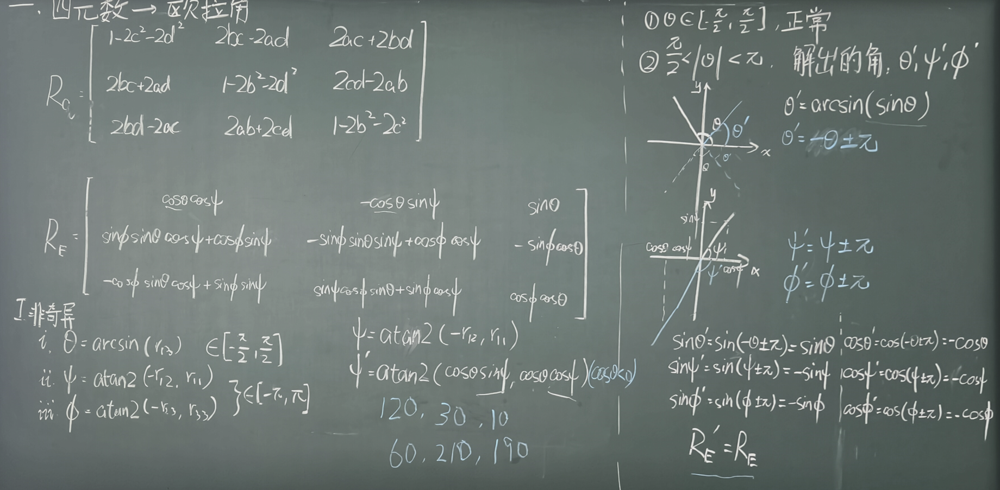

# 四元数与欧拉角的转换

---

@ Guanghong Zhang

## 一、 旋转定义与矩阵对照

在固定世界坐标系（外旋）或机体坐标系（内旋，如航向角-俯仰角-横滚角）下，常用的旋转顺序为 **Z-Y-X 外旋**。

我们这里先规定一下，**以下均基于Z-Y-X 外旋**。

设欧拉角定义如下：

- **$\psi$（航向角/Yaw）**：绕 $Z$ 轴旋转
- **$\theta$（俯仰角/Pitch）**：绕 $Y$ 轴旋转，取值范围 $\theta \in [-\frac{\pi}{2}, \frac{\pi}{2}]$ （这个后面会解释）
- **$\phi$（横滚角/Roll）**：绕 $X$ 轴旋转，取值范围 $\phi \in (-\pi, \pi]$

前面讲过，旋转复合矩阵表达为：

$$\vec{v}' = R_x(\phi) R_y(\theta) R_z(\psi) \vec{v} = R_E \vec{v}$$

通过匹配欧拉角导出的旋转矩阵 $R_E$ 与四元数导出的旋转矩阵 $R_q$，对应元素依次相等：

$$
R_E = \begin{bmatrix} \cos\psi\cos\theta & -\sin\psi\cos\theta & \sin\theta \\ \cos\psi\sin\theta\sin\phi + \sin\psi\cos\phi & -\sin\psi\sin\theta\sin\phi + \cos\psi\cos\phi & -\cos\theta\sin\phi \\ -\cos\psi\sin\theta\cos\phi + \sin\psi\sin\phi & \sin\psi\sin\theta\cos\phi + \cos\psi\sin\phi & \cos\theta\cos\phi \end{bmatrix}
$$

$$
R_q = \begin{bmatrix} 1-2c^2-2d^2 & 2bc-2ad & 2ac+2bd \\ 2bc+2ad & 1-2b^2-2d^2 & 2cd-2ab \\ 2bd-2ac & 2ab+2cd & 1-2b^2-2c^2 \end{bmatrix}
$$

## 二、 从四元数解算欧拉角

通过对比矩阵 $R_E$ 与 $R_q$ 中的对应元素 $r_{ij}$（$i$ 行 $j$ 列），可以逐个解出三个欧拉角：

### 2.1 解算俯仰角 $\theta$

可以先从最简单的项下手。观察矩阵右上角元素 $r_{13}$：

$$r_{13} = \sin\theta = 2ac + 2bd$$

由于 $\theta \in [-\frac{\pi}{2}, \frac{\pi}{2}]$，直接使用主值函数：
$$
\theta = \arcsin(r_{13}) = \arcsin(2ac + 2bd)
$$

### 2.2 解算航向角 $\psi$

对比元素 $r_{12}$ 与 $r_{11}$：

$$\frac{-r_{12}}{r_{11}} = \frac{\sin\psi\cos\theta}{\cos\psi\cos\theta} = \tan\psi$$

如果直接使用普通反正切函数 $\psi = \arctan\left(\frac{-r_{12}}{r_{11}}\right)$，由于 $\arctan(x)$ 的值域仅为 $\left(-\frac{\pi}{2}, \frac{\pi}{2}\right)$，当 $\psi \in (-\pi, \pi]$ 时会丢失象限信息（比如当 $\psi = -\frac{3\pi}{4}$ 时，$\tan\left(-\frac{3\pi}{4}\right) = 1$，直接算 $\arctan(1)$ 会误算为 $\frac{\pi}{4}$）。

因此必须使用四象限反切函数 **`atan2(y, x)`**：

$$\psi = \text{atan2}(-r_{12}, \; r_{11})$$

代入 $r_{12} = 2bc - 2ad$ 和 $r_{11} = 1 - 2c^2 - 2d^2$（或利用 $a^2+b^2-c^2-d^2$）：
$$
\psi = \text{atan2}(2ad - 2bc, \; 1 - 2c^2 - 2d^2)
$$

### 2.3 解算横滚角 $\phi$

对比右侧列元素 $r_{23}$ 与 $r_{33}$：

$$\frac{-r_{23}}{r_{33}} = \frac{\cos\theta\sin\phi}{\cos\theta\cos\phi} = \tan\phi$$

同样采用 `atan2` 保证全象限准确度：

$$\phi = \text{atan2}(-r_{23}, \; r_{33})$$

代入 $r_{23} = 2cd - 2ab$ 和 $r_{33} = 1 - 2b^2 - 2c^2$：

$$\phi = \text{atan2}(2ab - 2cd, \; 1 - 2b^2 - 2c^2)$$

总结一下三个角：

| **目标姿态角**      | **对应的矩阵元素比较**              | **最终四元数解算公式**                               |
| ------------------- | ----------------------------------- | ---------------------------------------------------- |
| **俯仰角 $\theta$** | $r_{13} = \sin\theta$               | $\theta = \arcsin(2ac + 2bd)$                        |
| **航向角 $\psi$**   | $\tan\psi = \frac{-r_{12}}{r_{11}}$ | $\psi = \text{atan2}(2ad - 2bc, \; 1 - 2c^2 - 2d^2)$ |
| **横滚角 $\phi$**   | $\tan\phi = \frac{-r_{23}}{r_{33}}$ | $\phi = \text{atan2}(2ab - 2cd, \; 1 - 2b^2 - 2c^2)$ |

这里引出了一个问题：值域同样是 $[-\frac{\pi}{2}, \frac{\pi}{2}]$ ，为什么 $\theta$ 解算的时候用 $\arcsin$ 就行，$\psi$ 和 $\phi$ 就需要 $\text{atan2}$ ？换句话说，为什么只有 $\theta \in [-\frac{\pi}{2}, \frac{\pi}{2}]$ ？

> AI解答：我们可以把机体（比如一架飞机）的姿态看作球面坐标系：
>
> 1. **航向角 $\psi$（Yaw）**：飞机可以朝东、南、西、北 360 度任意旋转，因此它的取值范围必须是 **$(-\pi, \pi]$（整整 360°）**。
> 2. **横滚角 $\phi$（Roll）**：飞机可以向左倾斜、甚至完全倒飞（翻转 180°），因此它的取值范围也必须是 **$(-\pi, \pi]$（整整 360°）**。
> 3. **俯仰角 $\theta$（Pitch）**：飞机抬头最多抬到垂直朝上（$+90^\circ$ 即 $\frac{\pi}{2}$），低头最多低到垂直朝下（$-90^\circ$ 即 $-\frac{\pi}{2}$）。
>
> #### 为什么 $\theta$ 不需要超过 $\pm 90^\circ$？
>
> 想象一下：如果飞机抬头过了 $90^\circ$（比如抬到了 $100^\circ$），在物理空间中，这**完全等价于**：
>
> - 航向角 $\psi$ 调头转了 $180^\circ$；
> - 横滚角 $\phi$ 翻转了 $180^\circ$（倒飞）；
> - 俯仰角 $\theta$ 实际上只抬了 $80^\circ$。
>
> 也就是说，**只要 $\psi$ 和 $\phi$ 的范围给够 360°，$\theta$ 只需要限制在 $[-90^\circ, 90^\circ]$ 内，就足以覆盖三维空间中机体朝向的所有可能姿态！** 如果允许 $\theta$ 超过 $\pm 90^\circ$，就会出现“同一种空间姿态对应两套不同欧拉角”的严重冗义。

从数学的角度，可以用板书上的方法证明。

> 26.09.16课后

### 2.4 奇异情况：万向节锁（$\theta = \pm 90^\circ$）

当 $\theta = \pm 90^\circ$ 时，$\cos\theta = 0$，此时矩阵退化，导致航向角 $\psi$ 与横滚角 $\phi$ 自由度重叠（发生万向节锁）。

#### 1. 当 $\theta = +90^\circ$（$\sin\theta = 1, \cos\theta = 0$）：

代入欧拉角旋转矩阵 $R_E$，矩阵退化为：

$$R_E = \begin{bmatrix} 0 & 0 & 1 \\ \sin(\phi + \psi) & \cos(\phi + \psi) & 0 \\ -\cos(\phi + \psi) & \sin(\phi + \psi) & 0 \end{bmatrix}$$

此时单个角 $\phi$ 或 $\psi$ 无法单独解算，只能解出两角之和：

$$\phi + \psi = \text{atan2}(r_{21}, \; r_{22})$$

由于存在无穷多解，我们可以习惯上直接**令 $\phi = 0$**，此时：

$$\psi = \text{atan2}(r_{21}, \; r_{22})$$

#### 2. 当 $\theta = -90^\circ$（$\sin\theta = -1, \cos\theta = 0$）：

代入欧拉角旋转矩阵 $R_E$，矩阵退化为：

$$R_E = \begin{bmatrix} 0 & 0 & -1 \\ \sin(\psi - \phi) & \cos(\psi - \phi) & 0 \\ \cos(\psi - \phi) & -\sin(\psi - \phi) & 0 \end{bmatrix}$$

此时可解出两角之差：

$$\psi - \phi = \text{atan2}(r_{21}, \; r_{22})$$

同样**令 $\phi = 0$**，直接求解航向角：

$$\psi = \text{atan2}(r_{21}, \; r_{22})$$

## 三、 从欧拉角转换四元数

采用 **$Z-Y-X$ 外旋**时，连续旋转变换写为：

$$\vec{v}' = R_x(\phi) R_y(\theta) R_z(\psi) \vec{v}$$

对应四元数的双边夹心运算：

$$V' = q_x \left( q_y \left( q_z V q_z^* \right) q_y^* \right) q_x^* = (q_x q_y q_z) V (q_x q_y q_z)^*$$

因此，总合成四元数写为：

$$q_{net} = q_x q_y q_z$$

下面是三个分量：

1. **绕 $Z$ 轴旋转 $\psi$（航向角/Yaw）**，旋转轴 $\vec{u}_z = (0, 0, 1)^T$：

   $$q_z = \begin{bmatrix} \cos\frac{\psi}{2} \\ 0 \\ 0 \\ \sin\frac{\psi}{2} \end{bmatrix}$$

2. **绕 $Y$ 轴旋转 $\theta$（俯仰角/Pitch）**，旋转轴 $\vec{u}_y = (0, 1, 0)^T$：

   $$q_y = \begin{bmatrix} \cos\frac{\theta}{2} \\ 0 \\ \sin\frac{\theta}{2} \\ 0 \end{bmatrix}$$

3. **绕 $X$ 轴旋转 $\phi$（横滚角/Roll）**，旋转轴 $\vec{u}_x = (1, 0, 0)^T$：

   $$q_x = \begin{bmatrix} \cos\frac{\phi}{2} \\ \sin\frac{\phi}{2} \\ 0 \\ 0 \end{bmatrix}$$

经过计算得出：
$$
q_{net} = \begin{bmatrix} a \\ b \\ c \\ d \end{bmatrix} = \begin{bmatrix} \cos\frac{\psi}{2}\cos\frac{\theta}{2}\cos\frac{\phi}{2} - \sin\frac{\psi}{2}\sin\frac{\theta}{2}\sin\frac{\phi}{2} \\ \cos\frac{\psi}{2}\cos\frac{\theta}{2}\sin\frac{\phi}{2} + \sin\frac{\psi}{2}\sin\frac{\theta}{2}\cos\frac{\phi}{2} \\ \cos\frac{\psi}{2}\sin\frac{\theta}{2}\cos\frac{\phi}{2} - \sin\frac{\psi}{2}\cos\frac{\theta}{2}\sin\frac{\phi}{2} \\ \sin\frac{\psi}{2}\cos\frac{\theta}{2}\cos\frac{\phi}{2} + \cos\frac{\psi}{2}\sin\frac{\theta}{2}\sin\frac{\phi}{2} \end{bmatrix}
$$
该算式可直接用于在已知姿态角（$\psi, \theta, \phi$）时快速初始化四元数 $q = a + bi + cj + dk$。

> 26.09.17课后
