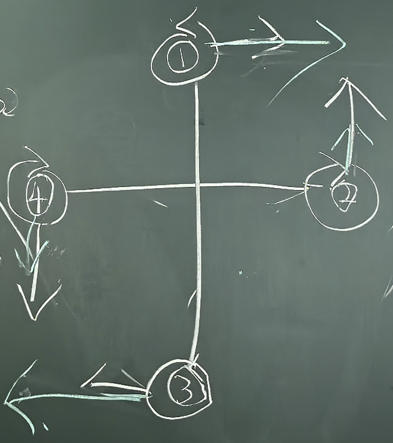

# 四轴飞行器运动机制与模型

---

@ Kai Gao

## 一、 物理基础概念对比

四轴飞行器的运动可分解为**平动**（位置变化）与**转动**（姿态变化）两种基本形式：

| **物理量维度** | **平动**                       | **转动 **                                                    |
| -------------- | ------------------------------ | ------------------------------------------------------------ |
| **描述参数**   | 位置 $\vec{r}$、速度 $\vec{v}$ | 姿态角（$\theta, \psi, \phi$）、角速度 $\boldsymbol{\omega}$ |
| **物理效应**   | 改变物体的空间位置             | 改变物体的空间姿态                                           |
| **惯性度量**   | 质量 $m$                       | 转动惯量 $J = m r^2$                                         |
| **作用力来源** | 合外力 $\vec{F}$               | 力矩 $\vec{M}$                                               |

**悬停条件**：螺旋桨产生的**总推力 $\approx$ 飞机的重力**，且四周力矩平衡。

## 二、 升力产生原理

单个螺旋桨高速旋转产生向上推力 $T$ 的机制可以从两个角度解释：

1. **伯努利定理（流体压强角度）**：
   - **条件**：同一流体，沿同一流线。
   - **原理**：流体流速越大，静压越小（上表面弧度大，流速大、压强小；下表面流速小、压强大）。
   - **结果**：上下表面形成**压强差**，产生向上的升力/推力。
2. **动量定理（空气动力角度）**：
   - **原理**：螺旋桨向下排挤空气，根据动量变化 $P = m v = F \cdot \Delta t \implies F = \frac{\Delta P}{\Delta t}$。
   - **结果**：空气对螺旋桨施加反作用力，提供向上的推力。

## 三、 反扭矩机制

螺旋桨旋转时，空气会阻碍螺旋桨的转动，就是空气阻力。

- **反扭矩产生过程**：

  $$\text{螺旋桨顺时针转动} \xrightarrow{\text{空气阻力}} \text{受逆时针阻力矩} \xrightarrow{\text{作用力与反作用力}} \text{电机/机身受到逆时针反作用力矩}$$

  螺旋桨顺时针转动，产生相反（逆时针）的空气阻力。为了维持转动，电机持续输出顺时针的力。由于牛顿第三定律，电机会受到反作用力，即受到逆时针力矩。

- **反作用**：若无对冲机制，若电机持续顺时针旋转，机身将会受反扭矩作用而持续**逆时针自旋**。

## 四、 四轴电机布局与转向平衡

为了抵消电机旋转产生的反扭矩，实现机身自旋平衡，四轴飞行器必须采用**“两顺时针、两逆时针”**的电机布局。

设电机标号为 $M_1, M_2, M_3, M_4$：

- $M_1, M_3$：**逆时针旋转 **
- $M_2, M_4$：**顺时针旋转 **

- **反扭矩向量分析**：
  - $M_1, M_3$ 逆时针转，给机身施加**顺时针反扭矩** $\circlearrowleft$；
  - $M_2, M_4$ 顺时针转，给机身施加**逆时针反扭矩** $\circlearrowright$。
- **结果**：在悬停或等速旋转时，$\sum M_{\text{反扭矩}} = 0$，偏航角（Yaw $\psi$）保持稳定不自旋。

## 五、 四轴机型构型分类

根据机臂与坐标轴的夹角，四轴飞行器主要分为两种常见布局：

1. **“+” 型布局（十字型）**：
   - 机臂分别沿坐标轴 $X, Y$ 排布，前方只有 1 个电机（$M_1$）。
2. **“X” 型布局（交叉型）**：
   - 机臂与坐标轴呈 $45^\circ$ 角，前方有 2 个电机。

> 26.09.19

# 四轴飞行器运动机制与模型（二）

@ Kai Gao & Hanyi Guo

## 一、 螺旋桨推力数学模型推导

首先给出结论：螺旋桨产生的拉力/推力 $T$ 与电机转速 $\omega$（或 $n$）满足正比于转速平方的关系：$T \propto n^2$ 或 $T = C_T n^2$。

下面从动量理论与翼型气动力学两个维度进行推导。   

### 1.1 动量理论推导

设桨盘面积为 $A$，空气密度为 $\rho$：   

- **单位时间内通过桨盘的空气质量流量**：

$$\dot{m} = \rho A v_i$$

其中 $v_i$ 为空气被桨盘加速到的**诱导速度**。   

- **远场尾流速度**：由动量守恒得远场速度约为 $w = 2 v_i$。   
- **拉力/推力公式**：

$$T = \dot{m} w = (\rho A v_i) \cdot (2 v_i) = 2 \rho A v_i^2$$

### 1.2 叶素理论与翼型受力分析

取半径 $r$ 处、宽度为 $dr$ 的微元叶素：   

- **合成速度 $v$**：$v = \sqrt{(\Omega r)^2 + v_i^2}$，其中 $\Omega = 2\pi n$ 为转速，$\Omega r$ 为切向速度。   
- **入流角 $\phi$**：在悬停及低速飞行时，$v_i \ll \Omega r$，可近似 $\phi \approx \frac{v_i}{\Omega r}$。   
- **攻角（迎角）$\alpha$**：$\alpha = \theta - \phi$，其中 $\theta(r)$ 为桨距角。   
- **微元推力积分**： 通过对标准翼型升力 $C_L$ 与阻力 $C_D$ 沿着半径 $0 \to R$ 进行积分：   

$$T = \int_0^R \left( \frac{1}{2}\rho v^2 C_L \cos\phi - \frac{1}{2}\rho v^2 C_D \sin\phi \right) c\,dr$$

化简后可得：

$$T = k \rho \Omega^2 \alpha = C_T n^2 \quad \implies \quad \mathbf{T \propto n^2}$$

> 这里涉及到很多空气动力学的知识，不需要完全搞明白

## 二、 单个螺旋桨的受力与力矩表达

对于第 $i$ 个螺旋桨，其在机体坐标系下产生的**升力**与**反扭矩**分别为：

1. **推力向量**：

$$\vec{F}_i = \begin{bmatrix} 0 \\ 0 \\ T_i \end{bmatrix} = \begin{bmatrix} 0 \\ 0 \\ C_T \omega_i^2 \end{bmatrix}$$

其产生的**推力偏心力矩**（设电机相对质心的位置向量为 $\vec{r}_i$）为：

$$\boldsymbol{\tau}_{\text{推力}} = \vec{r}_i \times \vec{F}_i = \begin{bmatrix} i \\ j \\ k \end{bmatrix} \times \dots = \begin{bmatrix} \tau_x \\ \tau_y \\ 0 \end{bmatrix}$$

**反扭矩向量**：

$$Q_i = k_m \omega_i^2$$

结合电机转向符号 $S_i$（$S_i = +1$ 表示逆时针 CCW；$S_i = -1$ 表示顺时针 CW）：   

$$\boldsymbol{\tau}_{\text{反扭矩}} = \begin{bmatrix} 0 \\ 0 \\ S_i Q_i \end{bmatrix} = \begin{bmatrix} 0 \\ 0 \\ S_i k_m \omega_i^2 \end{bmatrix}$$

## 三、 四轴飞行器四大基本运动模式

四轴飞行器通过改变四个电机的转速组合 $\omega_1, \omega_2, \omega_3, \omega_4$，改变**合力矩 $\boldsymbol{\tau}$（推力偏心力矩 + 反扭矩）**，进而控制机体姿态与运动。   

### 3.1 悬停、上升与下降

- **原理**：四个电机转速相等 $\omega_1 = \omega_2 = \omega_3 = \omega_4$。   
- **悬停 (Hovering)**：总推力等于重力 $4T \approx mg$。   
- **垂直上升 (Climb)**：同时增加四电机转速 $\omega_i \uparrow$，使总推力 $T_{\text{总}} > mg$。   
- **垂直下降 (Descend)**：同时降低四电机转速 $\omega_i \downarrow$，使总推力 $T_{\text{总}} < mg$。   

### 3.2 横滚运动 (Roll, $\phi$, 绕 $X$ 轴)

- **控制方式**：保持电机 $M_1, M_3$ 转速不变，打破左右电机平衡。   
- **向右横滚**：降低右侧电机 $M_2$ 转速（$\omega_2 \downarrow$），同时提高左侧电机 $M_4$ 转速（$\omega_4 \uparrow$）。   
- **力矩与受力**：
  - 左侧升力大于右侧升力，产生正向横滚力矩 $\tau_\phi > 0$。   
  - **保持总推力不变**：$\omega_2 \downarrow$ 与 $\omega_4 \uparrow$ 的幅度相同，确保垂直方向受力平衡，水平方向产生分力 $F_{\text{right}} = T \sin\phi$ 推动机身向右平移。   

### 3.3 俯仰运动 (Pitch, $\theta$, 绕 $Y$ 轴)

- **控制方式**：保持两侧电机 $M_2, M_4$ 转速不变，打破前后电机平衡。   
- **向前俯仰**：提高后方电机转速，降低前方电机转速。
- **力矩与受力**：
  - 产生俯仰力矩 $\tau_\theta$，机头向下倾斜，机体产生向前水平推力 $F_{\text{fwd}} = T \sin\theta$。

### 3.4 偏航运动 (Yaw, $\psi$, 绕 $Z$ 轴)

- **原理**：利用**反扭矩不平衡**产生偏航力矩，同时保证总推力不变。   
- **顺时针偏航（Yaw Right）**：
  - 增加逆时针电机转速 $\omega_2, \omega_4 \uparrow$（对应反扭矩为顺时针 $\circlearrowright$）。   
  - 降低顺时针电机转速 $\omega_1, \omega_3 \downarrow$（对应反扭矩为逆时针 $\circlearrowleft$）。   
  - **结果**：机身受到向右的顺时针反扭矩，绕 $Z$ 轴旋转，同时保持总推力 $T = mg$。   

## 四、 机体控制力矩映射方程

总结四轴飞行器的合力与合力矩输入公式：

$$\begin{bmatrix} F_{\text{总}} \\ \tau_\phi \\ \tau_\theta \\ \tau_\psi \end{bmatrix} = \begin{bmatrix} k_t & k_t & k_t & k_t \\ 0 & -l \cdot k_t & 0 & l \cdot k_t \\ l \cdot k_t & 0 & -l \cdot k_t & 0 \\ -k_m & k_m & -k_m & k_m \end{bmatrix} \begin{bmatrix} \omega_1^2 \\ \omega_2^2 \\ \omega_3^2 \\ \omega_4^2 \end{bmatrix}$$

其中：

- $l$ 为电机到中心质心的臂长。
- $\tau_\phi$（横滚力矩）：与 $( \omega_4^2 - \omega_2^2 )$ 成正比。   
- $\tau_\theta$（俯仰力矩）：与 $( \omega_1^2 - \omega_3^2 )$ 成正比。   
- $\tau_\psi$（偏航力矩）：与 $( \omega_2^2 + \omega_4^2 - \omega_1^2 - \omega_3^2 )$ 成正比。   

> 26.09.21