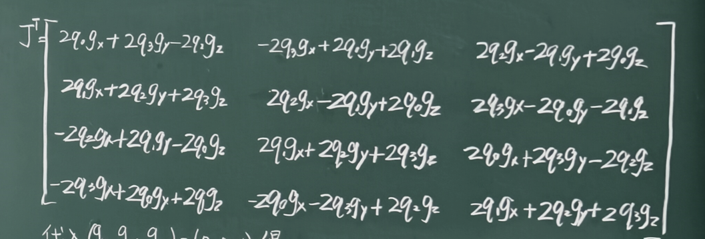

# 姿态估计中的残差建模与梯度下降算法

@ YANG Zhihe

## 一、姿态估计中的优化问题建立

在四轴飞行器中，我们尝试使用四元数来描述姿态。

- 地球重力加速度在地理坐标系（e系）中的理论值为 $g^e = [0, 0, 1]^T$。
- 载体上的加速度计测量值为 $a^s = [a_x, a_y, a_z]^T$。

根据之前的知识，我们可以利用姿态转换矩阵 $C_e^b$ 将理论重力向量转换到机体坐标系下，即 $$C_e^b g^e = a^s$$ 。

但实际上，难免存在传感器测量不准的情况。实际的情况应该是 $$C_e^b g^e \approx a^s$$。

我们可以利用之前残差的思想，构造 $$f_e = C_e^b g^e - a^s = q g^eq^* - a^s$$

这又与高斯牛顿法存在什么样的关系？

### 1.1 核心目标与问题定义

- **目标**：预测/估计四元数姿态 $q = (q_0, q_1, q_2, q_3)^T$。
- **基本原理**：
  - 地球重力加速度在地理坐标系（e系）中的理论值为 $g^e = [0, 0, 1]^T$。
  - 载体上的加速度计测量值为 $a^s = [a_x, a_y, a_z]^T$。
  - 利用姿态转换矩阵 $C_e^b$（或 $C_e^s$）将理论重力向量转换到机体坐标系下，与实际测量值进行对比：$$C_e^b g^e \approx a^s$$

### 1.2 残差向量（误差函数）建模

由于测量噪声和姿态估计误差的存在，两者之间存在残差向量 $f_e$：

$$
\min f_e = C_e^b g^e - a^s
$$
这是一个**关于 q1 q2 q3 q4** 的函数，我们需要找到合适的一组 q1 q2 q3 q4，使$f_e$ 最小（最接近于 0）。找到的这一组数据就是我们预测的四元数姿态。

C2讲过，利用四元数 $q$ 表示的姿态旋转矩阵 $C_e^b$：
$$
C_e^b = \begin{bmatrix} q_0^2 + q_1^2 - q_2^2 - q_3^2 & 2(q_1 q_2 + q_0 q_3) & 2(q_1 q_3 - q_0 q_2) \\ 2(q_1 q_2 - q_0 q_3) & q_0^2 - q_1^2 + q_2^2 - q_3^2 & 2(q_2 q_3 + q_0 q_1) \\ 2(q_1 q_3 + q_0 q_2) & 2(q_2 q_3 - q_0 q_1) & q_0^2 - q_1^2 - q_2^2 + q_3^2 \end{bmatrix}
$$
将 $g^e = [0, 0, 1]^T$ 代入矩阵乘法 $C_e^b g^e$，展开后可得具体的残差函数：

$$
\min f_e = \begin{bmatrix} 2(q_1 q_3 - q_0 q_2) - a_x \\ 2(q_2 q_3 + q_0 q_1) - a_y \\ 1 - 2(q_1^2 + q_2^2) - a_z \end{bmatrix}
$$

## 二、梯度下降法（Gradient Descent）

C4推导的**高斯-牛顿迭代更新公式**为：

$$
X_{k+1} = X_k - \left[ J_r^T J_r \right]^{-1} J_r^T r(X_k)
$$

- 其中 $J_r$ 为残差函数的雅可比矩阵。
- 高斯-牛顿法需要求解矩阵逆 $\left[ J_r^T J_r \right]^{-1}$，计算量相对较大。为了寻找计算更简便的替代方案，本节课引入了**梯度下降法**。

### 2.1 引入

从最简单的一元线性回归模型开始推导：

- 模型：$y = w x$，待求解参数为权重 $w$，已知样本点 $(x_i, y_i)$。
- 单样本误差平方：$e_i = (w x_i - y_i)^2$
- 总体均方误差：$$e = \frac{1}{n} \sum_{i=1}^{n} (w x_i - y_i)^2$$

对上式展开整理，可以写作关于待求参数 $w$ 的二次函数形式：

$$e = a w^2 + b w + c$$

对应下图中的抛物线：这是一个开口朝上的二次函数，最小值位于抛物线的底部（极小值点）。

误差函数 $e$ 对参数 $w$ 求梯度（一阶导数）：

$$\nabla e = \frac{\mathrm{d}e}{\mathrm{d}w} = 2a w + b$$

梯度 $\nabla e$ 指向函数增长最快的方向，这里增长最快的方向是负方向，因此**负梯度方向 $-\nabla e$** 就是函数下降最快的方向：

$$
W_{k+1} = W_k - \nabla E \cdot \mu
$$
这个式子的意思是，从第一个点开始，每次沿着下降最快的方向迭代一点，而迭代的“倍率”取决于 $\mu$

- $W_k$：当前参数估计值。
- $W_{k+1}$：更新后的参数值。
- $\nabla E$：当前点处的梯度（梯度向量）。
- $\mu$：学习率 / 步长。

如果 $\mu$ 固定，会出现在极小值点附近反复横跳的问题，所以需要 $\mu$ 是一个变化长度。这里先不仔细研究 $\mu$。

二维平面中梯度 $\nabla E$ 好求，和求导是一样的。实际中的多维偏导怎么得到呢？

多维偏导得到的是一个向量：$\nabla E = [\frac{dE}{dx},\frac{dE}{dy},\frac{dE}{dz},...]^T$

以下我们来尝试求 $\nabla E$ 

> 26.09.30

### 2.2 E梯度的计算

将一维模型的思路推广到四元数姿态估计中。   

- **目标变量**：四元数 $q = (q_0, q_1, q_2, q_3)^T$。   这q1 q2 q3 q4可以看作四个变量。

- **残差向量**：$f_e = R g^e - a^s = [f_x, f_y, f_z]^T$。（其中 $R$ 为姿态旋转矩阵 $C_e^b$，重力向量 $g^e = [0, 0, 1]^T$，加速度计测量值 $a^s = [a_x, a_y, a_z]^T$）。   我们要拟合合适的四元数 $q = (q_0, q_1, q_2, q_3)^T$，使得残差最接近于0。

- **总体目标函数**：这里 $f_e$ 是个向量，不能直接和0比较。但可以用模长。同时为了使最接近0的点成为极小值点，我们再加一个平方。前面加½为了后面求梯度方便。故而目标函数定义为：   
  $$
  E = \frac{1}{2} \Vert{}f_e\Vert{}^2
  $$

接着我们尝试求出目标函数对四元数的梯度 $\nabla E$。   

#### 1. 梯度链式法则推导

应用复合函数求导法则对 $E = \frac{1}{2} (f_x^2 + f_y^2 + f_z^2)$ 求梯度：

$$\nabla E = \frac{1}{2} \left( 2f_x \nabla f_x + 2f_y \nabla f_y + 2f_z \nabla f_z \right) = f_x \nabla f_x + f_y \nabla f_y + f_z \nabla f_z$$    （这里体现了为什么要加½）

改写为矩阵乘积形式：
$$
\nabla E = \begin{bmatrix} \nabla f_x & \nabla f_y & \nabla f_z \end{bmatrix} \begin{bmatrix} f_x \\ f_y \\ f_z \end{bmatrix} = \mathbf{J}^T f_e
$$
前面一项就是之前提过的雅可比矩阵，后一项就是fe。

#### 2. 雅可比矩阵 $J$ 的结构

其中，残差函数对四元数 $q$ 的雅可比矩阵 $J$ 定义为：   
$$
J = \begin{bmatrix} \nabla f_x^T \\ \nabla f_y^T \\ \nabla f_z^T \end{bmatrix} = \begin{bmatrix}  \frac{\partial f_x}{\partial q_0} & \frac{\partial f_x}{\partial q_1} & \frac{\partial f_x}{\partial q_2} & \frac{\partial f_x}{\partial q_3} \\ \frac{\partial f_y}{\partial q_0} & \frac{\partial f_y}{\partial q_1} & \frac{\partial f_y}{\partial q_2} & \frac{\partial f_y}{\partial q_3} \\ \frac{\partial f_z}{\partial q_0} & \frac{\partial f_z}{\partial q_1} & \frac{\partial f_z}{\partial q_2} & \frac{\partial f_z}{\partial q_3} \end{bmatrix}_{3 \times 4}
$$
l利用1.2中提到过的那个大矩阵，展开并转置就是这个样子：

   

#### 3. 代入已知重力方向 $g^e = [0, 0, 1]^T$ 简化雅可比转置矩阵 $J^T$

由于理想重力向量 $g_x = 0, g_y = 0, g_z = 1$，对残差偏导式代入简化后，直接得到转置雅可比矩阵 $J^T$ 的显式表达：   

$$J^T = \begin{bmatrix}  -2q_2 & 2q_1 & 2q_0  \\ 2q_3 & 2q_0 & -2q_1  \\ -2q_0 & 2q_3 & -2q_2 \\ 2q_1 & 2q_2 & 2q_3   \end{bmatrix}_{4 \times 3}$$

利用梯度下降法，四元数的迭代更新公式为：
$$
q_{k+1} = q_k - \mu \nabla E
$$
代入刚才求的 $\nabla E$ 展开写成各分量的形式：
$$
q_{k+1} = \begin{bmatrix} q_{0,k} - \mu \frac{\partial E}{\partial q_0} \\ q_{1,k} - \mu \frac{\partial E}{\partial q_1} \\ q_{2,k} - \mu \frac{\partial E}{\partial q_2} \\ q_{3,k} - \mu \frac{\partial E}{\partial q_3} \end{bmatrix}
$$
   

