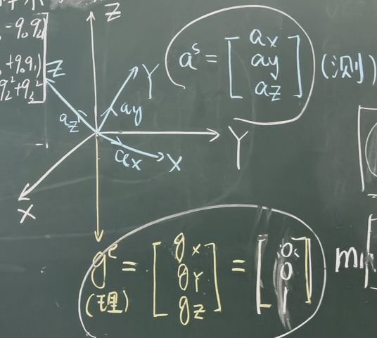
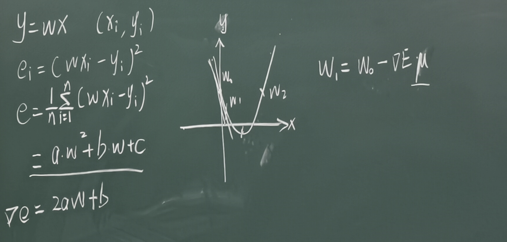

# 姿态估计中的残差建模与梯度下降算法

@ YANG Zhihe

## 一、姿态估计中的优化问题建立

在四轴飞行器中，我们尝试使用四元数来描述姿态。

- 地球重力加速度在地理坐标系（e系）中的理论值为 $g^e = [0, 0, 1]^T$。
- 载体上的加速度计测量值为 $a^s = [a_x, a_y, a_z]^T$。

根据之前的知识，我们可以利用姿态转换矩阵 $C_e^b$ 将理论重力向量转换到机体坐标系下，即 $$C_e^b g^e = a^s$$ 。

但实际上，难免存在传感器测量不准的情况。实际的情况应该是 $$C_e^b g^e \approx a^s$$。

我们可以利用之前残差的思想，构造 $$f_e = C_e^b g^e - a^s = q g^eq^* - a^s$$

这又与高斯牛顿法存在什么样的关系？

### 1.1 核心目标与问题定义

- **目标**：预测/估计四元数姿态 $q = (q_0, q_1, q_2, q_3)^T$。
- **基本原理**：
  - 地球重力加速度在地理坐标系（e系）中的理论值为 $g^e = [0, 0, 1]^T$。
  - 载体上的加速度计测量值为 $a^s = [a_x, a_y, a_z]^T$。
  - 利用姿态转换矩阵 $C_e^b$（或 $C_e^s$）将理论重力向量转换到机体坐标系下，与实际测量值进行对比：$$C_e^b g^e \approx a^s$$

### 1.2 残差向量（误差函数）建模

由于测量噪声和姿态估计误差的存在，两者之间存在残差向量 $f_e$：

$$
\min f_e = C_e^b g^e - a^s
$$
这是一个**关于 q1 q2 q3 q4** 的函数，我们需要找到合适的一组 q1 q2 q3 q4，使$f_e$ 最小（最接近于 0）。找到的这一组数据就是我们预测的四元数姿态。

C2讲过，利用四元数 $q$ 表示的姿态旋转矩阵 $C_e^b$：
$$
C_e^b = \begin{bmatrix} q_0^2 + q_1^2 - q_2^2 - q_3^2 & 2(q_1 q_2 + q_0 q_3) & 2(q_1 q_3 - q_0 q_2) \\ 2(q_1 q_2 - q_0 q_3) & q_0^2 - q_1^2 + q_2^2 - q_3^2 & 2(q_2 q_3 + q_0 q_1) \\ 2(q_1 q_3 + q_0 q_2) & 2(q_2 q_3 - q_0 q_1) & q_0^2 - q_1^2 - q_2^2 + q_3^2 \end{bmatrix}
$$
将 $g^e = [0, 0, 1]^T$ 代入矩阵乘法 $C_e^b g^e$，展开后可得具体的残差函数：

$$
\min f_e = \begin{bmatrix} 2(q_1 q_3 - q_0 q_2) - a_x \\ 2(q_2 q_3 + q_0 q_1) - a_y \\ 1 - 2(q_1^2 + q_2^2) - a_z \end{bmatrix}
$$

## 二、梯度下降法（Gradient Descent）

C4推导的**高斯-牛顿迭代更新公式**为：

$$
X_{k+1} = X_k - \left[ J_r^T J_r \right]^{-1} J_r^T r(X_k)
$$

- 其中 $J_r$ 为残差函数的雅可比矩阵。
- 高斯-牛顿法需要求解矩阵逆 $\left[ J_r^T J_r \right]^{-1}$，计算量相对较大。为了寻找计算更简便的替代方案，本节课引入了**梯度下降法**。

### 2.1 引入

从最简单的一元线性回归模型开始推导：

- 模型：$y = w x$，待求解参数为权重 $w$，已知样本点 $(x_i, y_i)$。
- 单样本误差平方：$e_i = (w x_i - y_i)^2$
- 总体均方误差：$$e = \frac{1}{n} \sum_{i=1}^{n} (w x_i - y_i)^2$$

对上式展开整理，可以写作关于待求参数 $w$ 的二次函数形式：

$$e = a w^2 + b w + c$$

对应下图中的抛物线：这是一个开口朝上的二次函数，最小值位于抛物线的底部（极小值点）。

误差函数 $e$ 对参数 $w$ 求梯度（一阶导数）：

$$\nabla e = \frac{\mathrm{d}e}{\mathrm{d}w} = 2a w + b$$

梯度 $\nabla e$ 指向函数增长最快的方向，这里增长最快的方向是负方向，因此**负梯度方向 $-\nabla e$** 就是函数下降最快的方向：

$$W_1 = W_0 - \nabla E \cdot \mu$$

这个式子的意思是，从第一个点开始，每次沿着下降最快的方向迭代一点，而迭代的“倍率”取决于u

- $W_0$：当前参数估计值。
- $W_1$：更新后的参数值。
- $\nabla E$：当前点处的梯度（梯度向量）。
- $\mu$：学习率 / 步长。

如果u固定，会出现在极小值点附近反复横跳的问题，所以需要u是一个变化长度。

多维偏导得到的是一个向量：$\nabla E = [\frac{dE}{dx},\frac{dE}{dy},\frac{dE}{dz},...]^T$

> 26.09.30

