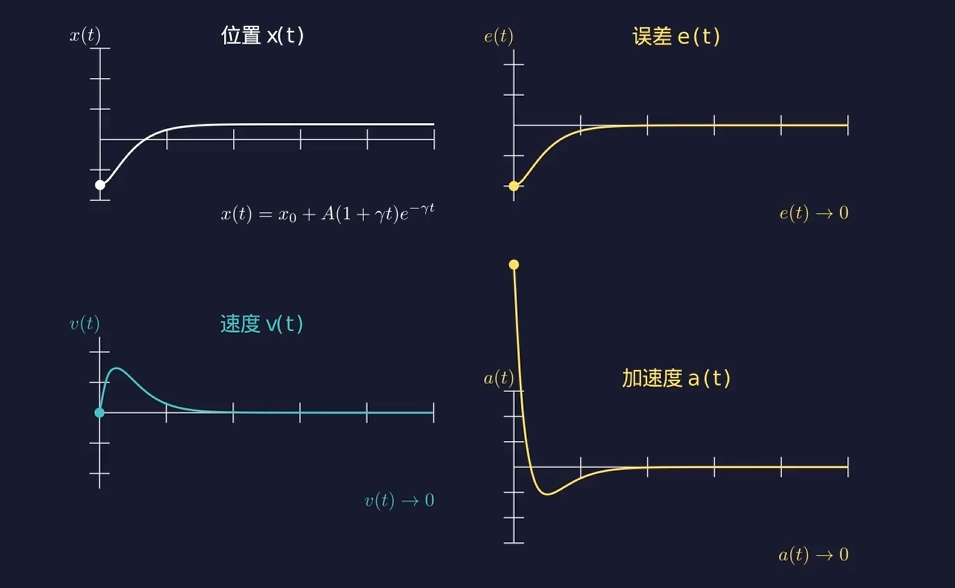

# PID 控制算法

> **Author**: jsrain

$$a(t) = K_p \cdot e(t) + K_i \cdot \int_0^t e(\tau) \, d\tau + K_d \cdot \frac{de(t)}{dt}$$

---

### 0. 前置知识

牛顿第二定律 $F=ma$ 

速度是位移的导数，加速度是速度的导数 $a(t)=\frac{dv(t)}{dt}=\frac{d^2 x(t)}{dt^2}$

在一个轴上，**x(t)**是小球的当前位置，**x0**是小球的目标位置。

定义t时刻小球位置和目标位置的差值 ==$e(t)=x(t)-x_0$==

### 1. P控制

首先想到的一种可能思路是：让小球的速度与e(t)成反比，即 $v(t)=K \cdot e(t)$

> 这里 K<0 。考虑了一下速度的方向。

但现实中速度难以直接控制，我们能直接控制的是升力，也就是**加速度**。

我们不妨把刚才的逻辑搬过来，让加速度和误差成正比。这就是P控制。写成公式就是：

==$$a(t) = K_p \cdot e(t)$$==

- 这样做的结果是什么呢？

$a(t) = \frac{d^2 x}{d t^2}, e(t)=x(t)-x_0  \quad\Longrightarrow\quad  \frac{d^2 x}{d t^2} = K_p \cdot (x(t)-x_0)$

需要解这个关于 x(t) 的微分方程。

> 解的过程在这里给出，可以跳过。
>
> ……
>
> ……
>
> ……
>
> 其实可以类比弹簧直接理解，很容易发现这是一个简谐运动。

得到：$$x(t) = x_0 + Acos(\omega t + \phi)$$ ，其中 $\omega = \sqrt{-K_p}$

这是一个**简谐运动**。

> 这里需要插入一个演示

- 为什么会有这样的结果？

原因在于它只关注了当前的误差距离，仅根据距离决定加减速的力度，而没有关注当前的速度。小球接近目标位置的过程中，加速度一直在减小，但方向始终没变（一直指向目标位置），速度会一直增加。小球在目标位置速度达到最大值，又冲到另一端，做永不停息的简谐运动。

可以想象开车即将撞上一堵墙的场景。当速度过大/过小时，就需要减小/增加当前加速度。

### 2. D控制

不妨给公式增加一项，根据当前的速度进行调整，当速度太大/小的时候，就增加/减小加速度：

$$a(t) = K_p \cdot e(t) + K_d \cdot v(t)$$

我们知道 $v(t)=\frac{dx}{dt}$，而e(t)与x(t)只差一个常数项-x0，所以$v(t)=\frac{de}{dt}$，式子就可以写成这样：

==$$a(t) = K_p \cdot e(t) + K_d \cdot \frac{de}{dt}$$==

> 演示。需要调节不同的Kd，给出四个坐标系曲线：x(t), e(t), v(t), a(t)
>
> 

Kd太小，依旧会过冲。Kd太大，还没到就刹停了。所以需要找到平衡的值。

回顾P和D的含义：

- P是Proportion（比例），反映“小球现在在哪里”，根据当前位置决定出力大小。
- D是Derivative（微分），反映“小球要往哪里去、去的多快”，提前减速预防过冲，物理上提供阻尼，吸收多余动能。

我们把这种控制器叫做PD控制器，它能比较出色的让小球停在目标位置。

### 3. I控制

- 还存在什么问题？

以上是在没有外力的情景下推导的。在我们的四轴飞行器应用中，存在重力这个重要因素。在接近目标位置时，升力逐渐减小，在减到0之前会和重力平衡。

> 这里需要模拟一下重力存在时的曲线。

飞行器会静止，但误差还没有归零。我们把这个系统稳定后仍然存在的误差叫做**稳态误差**。PD控制器无法消除稳态误差。

- 如何解决？

我们需要在加速度里再加一项积分，让它因为稳态误差的存在而持续修正。

$$a(t) = K_p \cdot e(t) + K_i \cdot \int_0^t e(\tau) \, d\tau + K_d \cdot \frac{de(t)}{dt}$$

PID中P是现在，I是过去，D是未来，一个公式集合了三个维度。

---

对于四轴飞行器，在转动上，令 $\theta$ 为倾角，$I$ 为转动惯量，电机差速产生力矩 $M$，我们有 $M = I \cdot \ddot{\theta}$

> 这个公式中，在小角度下，电机力矩$M$近似与左右电机的转速差成正比；$I$是转动惯量（由四轴的质量分布决定）；$\ddot{\theta}$是角度的二阶导（就是角加速度）。这个可以看成转动版的牛顿第二定律。

和前面直线的情况类似，

- 对角度只做 P 控制 → 飞机绕目标角度做简谐振荡（就像笔记里的纯 P 小球）；
- 加上角速度阻尼（D）→ 稳定停在目标角度；
- 这就是为什么姿态环必须同时"看角度"和"看角速度"。
