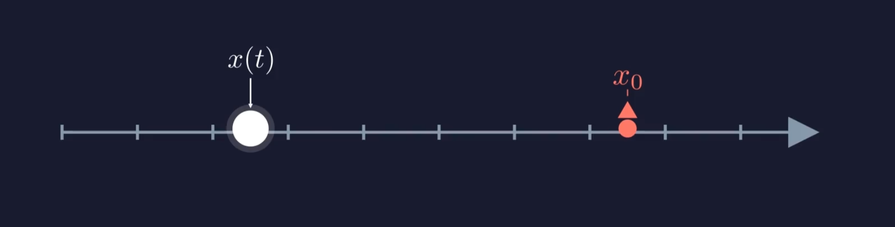

# PID 控制算法

> **Author**: jsrain

$$a(t) = K_p \cdot e(t) + K_i \cdot \int_0^t e(\tau) \, d\tau + K_d \cdot \frac{de(t)}{dt}$$

---

### 0. 前置知识

牛顿第二定律 $F=ma$ 

速度是位移的导数，加速度是速度的导数 $a(t)=\frac{dv(t)}{dt}=\frac{d^2 x(t)}{dt^2}$

### 1. 

在一个轴上，**x(t)**是小球的当前位置，**x0**是小球的目标位置。

定义t时刻小球位置和目标位置的差值==$e(t)=x(t)-x_0$==

首先想到的一种可能思路是：让小球的速度与e(t)成反比，即$v(t)=K \cdot e(t)$

> 这里 K<0 。考虑了一下速度的方向

速度难以直接控制，我们能直接控制的是升力，也就是**加速度**。

