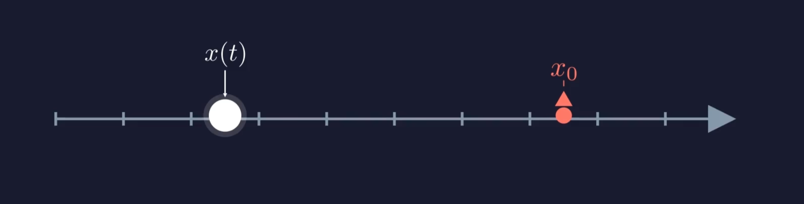

# PID 控制算法

> **Author**: jsrain


$$a(t) = K_p \cdot e(t) + K_i \cdot \int_0^t e(\tau) \, d\tau + K_d \cdot \frac{de(t)}{dt}$$

---

### 0. 前置知识

牛顿第二定律 $F=ma$ 

速度是位移的导数，加速度是速度的导数 $a(t)=\frac{dv(t)}{dt}=\frac{d^2 x(t)}{dt^2}$




在一个轴上，**x(t)**是小球的当前位置，**x0**是小球的目标位置。

定义t时刻小球位置和目标位置的差值 ==$e(t)=x(t)-x_0$==


### 1. P控制

首先想到的一种可能思路是：让小球的速度与e(t)成反比，即 $v(t)=K \cdot e(t)$

> 这里 K<0 。考虑了一下速度的方向。

但现实中速度难以直接控制，我们能直接控制的是升力，也就是**加速度**。

我们不妨把刚才的逻辑搬过来，让加速度和误差成正比。这就是P控制。写成公式就是：

==$$a(t) = K_p \cdot e(t)$$==

- 这样做的结果是什么呢？

$a(t) = \frac{d^2 x}{d t^2}, e(t)=x(t)-x_0  \quad\Longrightarrow\quad  \frac{d^2 x}{d t^2} = K_p \cdot (x(t)-x_0)$

需要解这个关于 x(t) 的微分方程。

> 解的过程在这里给出，可以跳过。
>
> ……
>
> ……
>
> ……
>
> 其实可以类比弹簧直接理解，很容易发现这是一个简谐运动。

得到：$$x(t) = x_0 + Acos(\omega t + \phi)$$ ，其中 $\omega = \sqrt{-K_p}$

这是一个**简谐运动**。

> 这里需要插入一个演示

- 为什么会有这样的结果？

原因在于它只关注了当前的误差距离，仅根据距离决定加减速的力度，而没有关注当前的速度。小球接近目标位置的过程中，加速度一直在减小，但方向始终没变（一直指向目标位置），速度会一直增加。小球在目标位置速度达到最大值，又冲到另一端，做永不停息的简谐运动。

可以想象开车即将撞上一堵墙的场景。当速度过大/过小时，就需要减小/增加当前加速度。


### 2. D控制

不妨给公式增加一项，根据当前的速度进行调整，当速度太大/小的时候，就增加/减小加速度：

$$a(t) = K_p \cdot e(t) + K_d \cdot v(t)$$

我们知道 $v(t)=\frac{dx}{dt}$，而e(t)与x(t)只差一个常数项-x0，所以$v(t)=\frac{de}{dt}$，式子就可以写成这样：

==$$a(t) = K_p \cdot e(t) + K_d \cdot \frac{de}{dt}$$==

> 演示。需要调节不同的Kd，给出四个坐标系曲线：x(t), e(t), v(t), a(t)
>
> 

Kd太小，依旧会过冲。Kd太大，还没到就刹停了。所以需要找到平衡的值。

回顾P和D的含义：

- P是Proportion（比例），反映“小球现在在哪里”，根据当前位置决定出力大小。
- D是Derivative（微分），反映“小球要往哪里去、去的多快”，提前减速预防过冲，物理上提供阻尼，吸收多余动能。

我们把这种控制器叫做PD控制器，它能比较出色的让小球停在目标位置。


### 3. I控制

- 还存在什么问题？

以上是在没有外力的情景下推导的。在我们的四轴飞行器应用中，存在重力这个重要因素。在接近目标位置时，升力逐渐减小，在减到0之前会和重力平衡。

> 这里需要模拟一下重力存在时的曲线。

飞行器会静止，但误差还没有归零。我们把这个系统稳定后仍然存在的误差叫做**稳态误差**。PD控制器无法消除稳态误差。

- 如何解决？

我们需要在加速度里再加一项积分，让它因为稳态误差的存在而持续修正。

$$a(t) = K_p \cdot e(t) + K_i \cdot \int_0^t e(\tau) \, d\tau + K_d \cdot \frac{de(t)}{dt}$$

> 为什么是积分，有什么意义，还需要补充。


PID中P是现在，I是过去，D是未来，一个公式集合了三个维度。


---


对于四轴飞行器，在转动上，令 $\theta$ 为倾角，$I$ 为转动惯量，电机差速产生力矩 $M$，我们有 $M = I \cdot \ddot{\theta}$

> 这个公式中，在小角度下，电机力矩$M$近似与左右电机的转速差成正比；$I$是转动惯量（由四轴的质量分布决定）；$\ddot{\theta}$是角度的二阶导（就是角加速度）。这个可以看成转动版的牛顿第二定律。

和前面直线的情况类似，

- 对角度只做 P 控制 → 飞机绕目标角度做简谐振荡（就像笔记里的纯 P 小球）；
- 加上角速度阻尼（D）→ 稳定停在目标角度；
- 这就是为什么姿态环必须同时"看角度"和"看角速度"。


# 四轴飞行器 PID 姿态控制：从物理第一性原理到数学推导

> **主公式**：

$$M(t) = K_p \cdot e(t) + K_i \cdot \int_0^t e(\tau) \, d\tau + K_d \cdot \frac{de(t)}{dt}$$

## 0. 前置知识与物理建模

在探讨四轴飞行器如何稳定前，我们需要先写出它的**转动版牛顿第二定律**。

- **平动**：$F = m \cdot a = m \cdot \ddot{x}$（力 $F$ 产生线加速度 $a$）
- **转动**：$M = I \cdot \alpha = I \cdot \ddot{\theta}$（力矩 $M$ 产生角加速度 $\alpha$）

对于四轴飞行器（以 Pitch 轴俯仰角 $\theta$ 为例）：

- $\theta(t)$ 是飞行器当前的**实际姿态角**，$\theta_0$ 是我们期望的**目标姿态角**（如 $0^\circ$ 悬停）。
- $I$ 是飞行器绕该轴的**转动惯量**（由质量分布决定）。
- $M(t)$ 是左右/前后电机产生差速时施加给机身的**合力矩**（这是我们能直接控制的物理量）。
- 定义 $t$ 时刻的姿态偏差为：$e(t) = \theta_0 - \theta(t)$

## 1. P 控制（比例控制）

### 1.1 思路引入

最直观的想法是：**机身偏斜的角度越大，给的反向纠正力矩就应该越大**。即让力矩 $M(t)$ 与误差 $e(t)$ 成正比：

==

$$M(t) = K_p \cdot e(t) = K_p \cdot (\theta_0 - \theta(t))$$

==

### 1.2 数学推导：带入动力学方程

将 $M(t) = I \cdot \ddot{\theta}(t)$ 代入上式：

$$I \cdot \ddot{\theta}(t) = K_p \cdot (\theta_0 - \theta(t))$$

整理得到关于姿态角 $\theta(t)$ 的二阶常系数齐次线性微分方程：

$$\ddot{\theta}(t) + \frac{K_p}{I} \cdot \theta(t) = \frac{K_p}{I} \cdot \theta_0$$

设初始条件为：飞行器从偏斜角 $\theta(0) = A + \theta_0$ 静止释放（$\dot{\theta}(0) = 0$），解此微分方程可得：

$$\theta(t) = \theta_0 + A \cos(\omega t)$$

其中，系统的自然旋转角频率为：$\omega = \sqrt{\frac{K_p}{I}}$

### 1.3 物理本质与缺陷

微分方程的解明确表明：**纯 P 控制下，四轴飞行器会在目标角度 $\theta_0$ 两侧做永不停息的“角简谐运动”！**

- **为什么会这样？**

  纯 P 控制只看“当前角度在哪里”。当飞行器向目标角度 $\theta_0$ 回正时，随着误差减小，力矩 $M(t)$ 在减小，但**方向一直没变**（始终在加速回正）。

  当达到目标角度 $\theta_0$ 时，虽然 $e(t)=0$ 使得力矩归零，但此时**角速度达到了最大值**！巨大的旋转惯性会冲过头，导致飞行器在另一侧继续过冲，产生剧烈的来回晃动与振荡。

## 2. D 控制（微分控制）

### 2.1 思路引入：如何刹车？

为了防止过冲，我们需要根据当前的旋转速度（角速度）加入制动机制。当旋转太快时，提前反向打力矩进行“刹车”：

$$M(t) = K_p \cdot e(t) + K_d \cdot \omega(t) = K_p \cdot e(t) + K_d \cdot \dot{e}(t)$$

由于目标角度 $\theta_0$ 是常数，$\dot{e}(t) = \frac{d(\theta_0 - \theta)}{dt} = -\dot{\theta}(t) = -\omega_{gyro}$（即 IMU 陀螺仪直接测得的**物理角速度**的反数）。因此：

==

$$M(t) = K_p \cdot e(t) - K_d \cdot \dot{\theta}(t)$$

==

### 2.2 数学推导：阻尼微分方程

将动力学方程 $M(t) = I \cdot \ddot{\theta}(t)$ 代入：

$$I \cdot \ddot{\theta}(t) + K_d \cdot \dot{\theta}(t) + K_p \cdot \theta(t) = K_p \cdot \theta_0$$

两边同除以 $I$：

$$\ddot{\theta}(t) + \frac{K_d}{I} \cdot \dot{\theta}(t) + \frac{K_p}{I} \cdot \theta(t) = \frac{K_p}{I} \cdot \theta_0$$

对照经典阻尼振动方程 $\ddot{x} + 2\zeta\omega_n \dot{x} + \omega_n^2 x = 0$，我们可以严格导出系统的**阻尼比 $\zeta$**：

$$\omega_n = \sqrt{\frac{K_p}{I}}, \quad \zeta = \frac{K_d}{2\sqrt{K_p \cdot I}}$$

根据 $K_d$ 的大小（即阻尼比 $\zeta$），系统展现出三种完全不同的物理状态：

```
      姿态角 θ(t)
        ^
        |     欠阻尼 (Kd太小, 发生过冲振荡)
        |    /  \
  θ0 ---|---/----\--------------------- (目标角度)
        |  /      \_____ 过阻尼 (Kd太大, 响应极其迟钝)
        | /
        |/_____________ 临界阻尼 (Kd适中, 最快且平稳停下)
        +-----------------------------------> 时间 t
```

1. **欠阻尼（$\zeta < 1$，$K_d$ 过小）**：制动力不足，飞行器依然会冲过头并来回震荡数次。
2. **过阻尼（$\zeta > 1\(，\)K_d$ 过大）**：阻尼太大，飞行器像陷进了浓稠的蜂蜜里，缓慢爬升，很久都无法达到指定角度。
3. **临界阻尼（$\zeta = 1$，$K_d$ 适中）**：**四轴调参追求的理想状态**！飞行器以最快速度趋近目标角度，且完全不过冲。

- **P 与 D 的物理总结**：
  - **P（比例）**：反映“**飞机现在偏了多少**”，在物理上相当于一根**虚拟旋转弹簧**，负责提供回正拉力。
  - **D（微分）**：反映“**飞机转得有多快**”，在物理上相当于一个**旋转阻尼器**（如液压阻尼），负责吸收动能、提前制动。

## 3. I 控制（积分控制）

### 3.1 现实困境：稳态误差（Steady-State Error）

在没有外力的理想情况下，PD 控制已经能让飞行器完美停在目标角度。但四轴飞行器在现实中面临着持续的非对称外力：

- 飞行器**重心偏移**（如电池没挂在中心）。
- 4 个电机的**老化程度不同**或螺旋桨拉力微小不对称。
- 持续的**侧向阵风**。

假设重心偏右，要维持 $0^\circ$ 水平悬停，电机必须持续输出一个**固定的补偿力矩 $M_{bias}$** 来抵消重心偏移。

在 PD 控制下：$M(t) = K_p \cdot e(t) - K_d \cdot \dot{\theta}(t)$。

当飞行器最终静止不动时（$\dot{\theta}(t) = 0$），要产生恒定的 $M_{bias}$，就**必须保持一个不为零的角度偏差 $e_{ss}$**：

$$M_{bias} = K_p \cdot e_{ss} \implies e_{ss} = \frac{M_{bias}}{K_p}$$

这意味着：**只要有重心偏移或外力，PD 控制器就绝对无法让残余误差归零，系统稳定后依然存在的误差叫做“稳态误差”**。

### 3.2 解决办法：引入历史累积（积分项）

为了消除这一顽固的稳态误差，我们需要引入一个能够**对“过去的误差”进行时间累积**的项：

==

$$M_i(t) = K_i \cdot \int_0^t e(\tau) \, d\tau$$

==

- **为什么积分能够彻底消除稳态误差？**

  只要残余误差 $e(t)$ 稍微不为零（哪怕只有 $0.1^\circ$），时间 $\tau$ 一过，积分值 $\int_0^t e(\tau) \, d\tau$ 就会像蓄水池一样**持续不断地增加**。

  这会推动控制力矩 $M(t)$ 越来越大，直到把飞行器强行推回到 $e(t) = 0$（完全平稳）。此时，虽然 $e(t)=0$ 使得 P 项归零，但**积分项会停留在之前累积好的数值上**，继续提供那个抵消重心偏移的恒定力矩 $M_{bias}$！

## 4. 终极总结与三维视角

将 P、I、D 三项合并，我们得到了四轴飞行器姿态力矩控制的全貌：

$$M(t) = \underbrace{K_p \cdot e(t)}_{\text{现在（弹簧力）}} + \underbrace{K_i \cdot \int_0^t e(\tau) \, d\tau}_{\text{过去（历史纠偏）}} + \underbrace{K_d \cdot \frac{de(t)}{dt}}_{\text{未来（阻尼制动）}}$$

| **PID 分量** | **视角** | **物理对应**     | **解决的问题**                   | **带来的新问题**                   |
| ------------ | -------- | ---------------- | -------------------------------- | ---------------------------------- |
| **P (比例)** | **现在** | 旋转弹簧（刚度） | 提供基础回正动力                 | 导致系统发散或等幅**简谐振荡**     |
| **D (微分)** | **未来** | 旋转阻尼（阻尼） | 吸收动能，阻碍运动，**消除过冲** | 容易放大 IMU 陀螺仪的高频噪声      |
| **I (积分)** | **过去** | 恒定推力蓄能器   | 消除重心偏移导致的**稳态误差**   | 累积过大时易引发**超调与积分饱和** |

## 5. 迁移到四轴双环控制的补充思考

在实际飞控中，因为电机直接受控的是**角速度（$\dot{\theta}$）\**而非角度本身，工业界通常采用\**串级 PID**：

- **外环（角度环）**：计算角度误差 $e_\theta = \theta_0 - \theta$，仅用 P 控制输出一个**期望角速度 $\dot{\theta}_d$**。
- **内环（角速度环）**：将期望角速度与陀螺仪实测角速度比较，用 **PID 控制**直接输出**电机力矩 $M(t)$**。

**串级控制的物理本质**：将“角度到力矩”的二阶系统，拆解为两个一阶系统，极大地降低了调参难度并提升了抗风性能！
