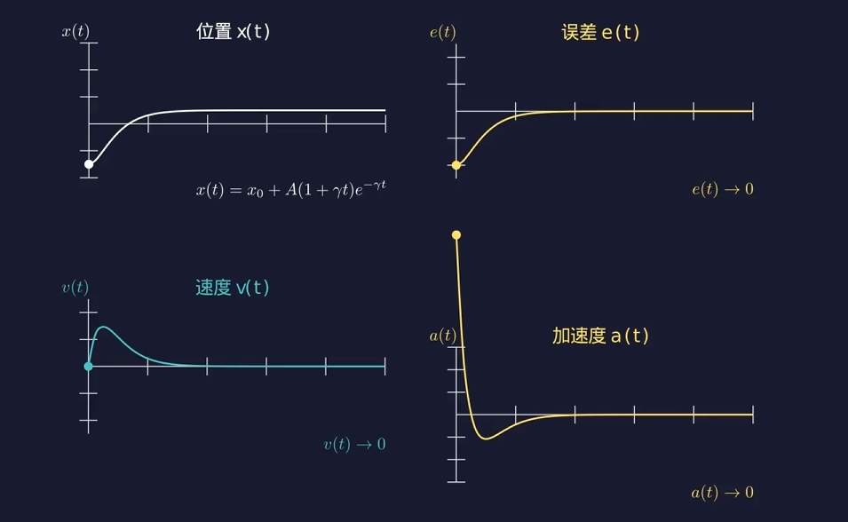

# 从连续控制到四轴飞行器 PID 姿态反馈控制

## 一、 为什么我们需要控制？（问题的引入与四轴飞行器背景）

### 1. 四轴飞行器的物理本质与控制挑战

四轴飞行器是一个典型的**无舵面、靠多电机差异化转速驱动**的系统。它在三维空间中拥有 6 个自由度（3 个位置自由度 $x, y, z$，3 个姿态角自由度：滚转角 Roll $\phi$、俯仰角 Pitch $\theta$、偏航角 Yaw $\psi$），但仅通过 4 个电机的转速（产生 4 个拉力 $F_1, F_2, F_3, F_4$）来进行控制。

这使得四轴飞行器在动力学上是一个**欠驱动、强耦合、非线性且高度不稳定**的系统。

在实际飞行中，哪怕我们给 4 个电机施加完全相同的理论电压，由于以下原因，飞行器也不可能稳定悬停：

- **结构与电气不对称**：电机螺距差异、轴承摩擦不均、电池电压骤降。
- **外部气流扰动**：阵风、地面效应（Ground Effect）、涡环状态。
- **传感器噪声**：IMU（惯性测量单元）陀螺仪与加速度计的测量高频噪声与零偏。

因此，**开环控制（Open-Loop Control）在四轴飞行器上是绝对行不通的**。我们必须引入**闭环反馈控制（Closed-Loop Feedback Control）**。

### 2. 闭环控制的核心思维：如何消除误差？

我们以四轴飞行器的姿态角控制（以俯仰角 $\theta$ 为例）为例：

- **期望状态（Set Point, $r(t)$）**：遥控器手柄给出的期望俯仰角 $\theta_{d}$（例如 $0^\circ$ 悬停）。
- **测量状态（Process Variable, $y(t)$）**：IMU 经过姿态解算得到的当前实际俯仰角 $\theta$。

我们定义系统在 $t$ 时刻的控制误差（Error）为：

$$e(t) = r(t) - y(t) = \theta_d(t) - \theta(t)$$

**控制的核心任务**：寻找一个控制律（Control Law），根据误差 $e(t)$ 计算出合理的控制量 $u(t)$（最终映射为电机的期望转速或 PWM 信号），使得系统在面对外界扰动时，误差 $e(t)$ 能迅速、平稳、无残留地趋近于 $0$。


**我们想做什么：控制误差 $e(t)$**

**我们有什么：我们能控制电机转速，可以产生纠正力矩**


在探讨四轴飞行器如何稳定前，我们需要先写出它的**转动版牛顿第二定律**。

- **平动**：$F = m \cdot a = m \cdot \ddot{x}$（力 $F$ 产生线加速度 $a$）
- **转动**：$M = I \cdot \alpha = I \cdot \ddot{\theta}$（力矩 $M$ 产生角加速度 $\alpha$）

对于四轴飞行器（以 Pitch 轴俯仰角 $\theta$ 为例）：

- $\theta(t)$ 是飞行器当前的**实际姿态角**，$\theta_0$ 是我们期望的**目标姿态角**（如 $0^\circ$ 悬停）。
- $I$ 是飞行器绕该轴的**转动惯量**（由质量分布决定）。
- $M(t)$ 是左右/前后电机产生差速时施加给机身的**合力矩**（这是我们能直接控制的物理量）。
- 定义 $t$ 时刻的姿态偏差为：$e(t) = \theta_0 - \theta(t)$

## 二、 如何解决这个问题？（PID 控制器的理论演进与推导）

既然我们知道了要消除误差 $e(t)$，那么最自然的想法是：**我们应该如何利用这个误差信息来构建控制量 $u(t)$？**

经典的 PID（Proportional-Integral-Derivative）控制器给出了极具物理直觉且数学上完备的解答：**从“现在”、“过去”和“未来”三个时间维度来协同处理误差。**

### 1. 考虑“现在”：比例项（Proportional Term, P）

如果飞行器向后倾斜了 $10^\circ$（$e(t) = 10^\circ$），控制系统就应该让前推力大于后推力，产生一个反向的纠正力矩 $M_p$。

首先，我们最直观的想法是：**现在的误差有多大，给出的纠正力矩就应该有多大**。

误差小，我们就轻轻“推”（施加力矩）；误差大，推的就重一些。

可以从最简单的数学关系入手：**力矩与误差成正比**。
$$
u_P(t) = K_p e(t)
$$
其中 $K_p$ 为**比例增益**。


- **这样做的结果是什么呢**？

  > 给大家 5 分钟时间，请同学们计算一下

将 $M(t) = I \cdot \ddot{\theta}(t)$ 代入上式：

$$I \cdot \ddot{\theta}(t) = K_p \cdot (\theta_0 - \theta(t))$$

整理得到关于姿态角 $\theta(t)$ 的二阶常系数齐次线性微分方程：

$$\ddot{\theta}(t) + \frac{K_p}{I} \cdot \theta(t) = \frac{K_p}{I} \cdot \theta_0$$

设初始条件为：飞行器从偏斜角 $\theta(0) = A + \theta_0$ 静止释放（$\dot{\theta}(0) = 0$），解此微分方程可得：

$$\theta(t) = \theta_0 + A \cos(\omega t)$$

其中，系统的自然旋转角频率为：$\omega = \sqrt{\frac{K_p}{I}}$

微分方程的解明确表明：**纯 P 控制下，四轴飞行器会在目标角度 $\theta_0$ 两侧做永不停息的“角简谐运动”！**

- **为什么会这样？**

  纯 P 控制只看“当前角度在哪里”。当飞行器向目标角度 $\theta_0$ 回正时，随着误差减小，力矩 $M(t)$ 在减小，但**方向一直没变**（始终在加速回正）。

  当达到目标角度 $\theta_0$ 时，虽然 $e(t)=0$ 使得力矩归零，但此时**角速度达到了最大值**！巨大的旋转惯性会冲过头，导致飞行器在另一侧继续过冲，产生剧烈的来回晃动与振荡。

  类似弹簧。

- **致命缺陷 1：无法消除静态误差（Steady-State Error）**

  假设四轴飞行器的重心偏后（存在一个恒定的机身扰动力矩 $M_{dist}$）。要维持当前姿态平衡，电机必须输出一个恒定的纠正力矩 $M_c = M_{dist}$。

  由于 $u_P = K_p e$，要使 $u_P \neq 0$，就必须保证 $e(t) \neq 0$！

  也就是说，系统**必须保留一部分残余误差**才能产生克服重心的力矩。这导致飞行器永远无法精准达到期望角度（存在稳态误差）。

- **致命缺陷 2：高增益引发等幅振荡**

  如果我们为了减小稳态误差而把 $K_p$ 调得非常大（加硬弹簧），飞行器一旦受扰，纠正力过猛会导致**超调（Overshoot）**，过冲到另一侧后又反向大发力，最终导致系统在期望点附近剧烈烈振荡甚至发散翻机。

## 2. D 控制（微分控制）

### 2.1 思路引入：如何刹车？

为了防止过冲，我们自然地想到，可以根据当前的角速度加入制动机制。当旋转太快时，提前反向打力矩进行“刹车”，来抑制当前过高的角速度。当前角速度越大，这个抑制的力矩就越大，也可以假设成正比：

$$M(t) = K_p \cdot e(t) + K_d \cdot \omega(t) = K_p \cdot e(t) + K_d \cdot \dot{e}(t)$$  ==？==

由于目标角度 $\theta_0$ 是常数，$\dot{e}(t) = \frac{d(\theta_0 - \theta)}{dt} = -\dot{\theta}(t) = -\omega_{gyro}$（即 IMU 陀螺仪直接测得的**物理角速度**的反数）。因此：

$$M(t) = K_p \cdot e(t) - K_d \cdot \dot{\theta}(t)$$


> 演示。需要调节不同的Kd，给出四个坐标系曲线：x(t), e(t), v(t), a(t)
>
> 

Kd太小，依旧会过冲。Kd太大，还没到就刹停了。所以需要找到平衡的值。


### 2.2 数学推导：阻尼微分方程

现在，我们把带有阻尼的总力矩 $M(t) = K_p(\theta_0 - \theta) - K_d \dot{\theta}(t)$，代回转动动力学方程 $M = I \cdot \ddot{\theta}$ 中：

$$I \cdot \ddot{\theta}(t) = K_p \cdot (\theta_0 - \theta(t)) - K_d \cdot \dot{\theta}(t)$$

为了方便看清楚，我们将含有 $\theta$ 的项全部移到左边，常数项留在右边，并将两边同时除以转动惯量 $I$：

$$\ddot{\theta}(t) + \frac{K_d}{I} \dot{\theta}(t) + \frac{K_p}{I} \theta(t) = \frac{K_p}{I} \theta_0$$

**为什么加了中间这一项 $\frac{K_d}{I} \dot{\theta}(t)$，系统就不会像纯 P 控制那样无限振荡了？**

在纯 P 控制时，方程是 $\ddot{\theta} + \frac{K_p}{I}\theta = \text{常数}$，特征方程的解是纯虚数 $\pm i\omega$，代表**没有能量衰减的余弦波（简谐运动）**。

而现在，根据微积分求解常系数线性微分方程的标准方法，我们设解的形式为 $\theta(t) = C e^{r t}$，代入齐次方程得到**特征方程**：

$$r^2 + \frac{K_d}{I} r + \frac{K_p}{I} = 0$$

用一元二次方程求根公式解出 $r$：

$$r = \frac{-\frac{K_d}{I} \pm \sqrt{\left(\frac{K_d}{I}\right)^2 - 4\frac{K_p}{I}}}{2}$$

**这就是系统会不会过冲振荡的决定性时刻！根号里面的表达式决定了三种命运：**

1. **当 $K_d$ 较小，使得 $\left(\frac{K_d}{I}\right)^2 - 4\frac{K_p}{I} < 0$ 时**：

   根号下为负数，解出复数根 $r = -\alpha \pm i \beta$。

   此时 $\theta(t)$ 的解中包含衰减项 $e^{-\alpha t}$ 与振荡项 $\cos(\beta t)$。

   - **物理表现**：飞行器虽然还会冲过头振荡，但因为 $e^{-\alpha t}$ 的存在，**振幅会一次比一次小，最终慢慢停下来**。

2. **当 $K_d$ 大小刚好，使得 $\left(\frac{K_d}{I}\right)^2 - 4\frac{K_p}{I} = 0$ 时**：

   根号下为 0，解出两个相同的实根 $r = -\frac{K_d}{2I}$。

   此时解为 $\theta(t) = (C_1 + C_2 t) e^{-\frac{K_d}{2I} t}$，**完全没有虚数部分（没有 $\sin/\cos$ 振荡项）**！

   - **物理表现**：**最完美的状态**！飞行器以最快速度趋近目标角度，且完全不过冲、不振荡。此时解出的关系为：

$$K_d = 2 \sqrt{K_p \cdot I}$$

1. **当 $K_d$ 过大，使得 $\left(\frac{K_d}{I}\right)^2 - 4\frac{K_p}{I} > 0$ 时**：

   根号下为正数，解出两个不同的负实根。

   - **物理表现**：阻力太大，飞行器像陷在浓稠的蜂蜜里一样，极其缓慢地爬升，很久都达不到目标角度。


## 3. I 控制（积分控制）

### 3.1 现实困境：PD 控制下的“稳态误差”

我们在前面的 PD 控制中，给飞行器加上了“弹簧回电力（P）”和“阻尼制动力（D）”，推导出了完美的临界阻尼运动。但这全部建立在一个假设上：**外界没有任何持续作用的干扰力矩。**   

但在现实飞行中，飞行器必然会遇到**恒定的外力矩 $M_{bias}$**：

- 飞行器的重心偏左或偏右（电池没挂在物理中心）。   
- 四个电机的风叶老化程度不同，导致左右拉力不对称。   
- 外部存在持续的单向侧风。   

#### 物理矛盾出现：

假设飞行器重心偏右，需要系统持续输出一个**大小为 $M_{bias}$ 的左倾力矩**才能维持 $0^\circ$ 水平悬停。   

此时，我们看 PD 控制器的出力公式：

$$M(t) = K_p \cdot e(t) + K_d \cdot \dot{e}(t)$$

当飞行器最终**静止**在某个角度时，角速度为 0，即 $\dot{e}(t) = 0$。公式简化为：   

$$M(t) = K_p \cdot e(t)$$

为了抵抗恒定的重心情偏力矩 $M_{bias}$，控制力矩必须满足 $M(t) = M_{bias}$。代入上式得：   

$$M_{bias} = K_p \cdot e(t) \implies e(t) = \frac{M_{bias}}{K_p}$$

**看看这个结果多么绝望**： 因为 $M_{bias} \neq 0$，所以**误差 $e(t)$ 绝对不可能等于 0**！ 这意味着：只要重心是偏的，PD 控制器就必须**强行保留一个偏角（残余误差）**，靠这个残余误差产生的 P 力矩去和重力抵消。这个系统稳定后依然顽固存在的误差，就叫**稳态误差（Steady-State Error）**。   

### 3.2 寻找数学工具：为什么偏偏要用“积分”？

现在我们的需求变了：**我们希望在姿态完全回正（$e(t) = 0$）时，控制器依然能输出一个不为 0 的力矩 $M_{bias}$！**

- 如果用 **P（比例）**：$e(t) = 0 \implies P = 0$，失效。   
- 如果用 **D（微分）**：$e(t) = 0 \implies \dot{e}(t) = 0 \implies D = 0$，失效。   

我们需要一种全新的数学机制，它必须满足以下两个苛刻条件：

1. **只要误差 $e(t) \neq 0$**（哪怕只有 $0.01^\circ$），它的输出值就要**随着时间不断增加**，力矩越加越大，强行把飞行器往回推。
2. **当误差终于归零（$e(t) = 0$）时**：它的输出**不能归零**，而是必须**锁定（定格）在刚才累加到的数值上**，继续扛着 $M_{bias}$！

**在高等数学的工具箱里，什么东西具备这种“只要你有，我就一直加；你没了，我就停在原高度”的记忆特性？**

答案就是：**对时间的定积分 $\int_0^t e(\tau) d\tau$**！   

- **验证条件 1**：当存在微小稳态误差 $e(t) = e_{ss} > 0$ 时：

$$M_i(t) = K_i \int_0^t e_{ss} d\tau = K_i \cdot e_{ss} \cdot t$$

随着时间 $t$ 增加，输出 $M_i(t)$ 呈线性函数无限上升！哪怕误差再小，时间一长，推力也会被放大到足以克服重心的偏置。   

- **验证条件 2**：当飞行器终于被推回水平位置，误差消除（$e(t) = 0$）时：

  对 0 求积分，积分值**不再增加，但也绝不减少**：

$$M_i(t) = \text{之前累积的常数项 } C = M_{bias}$$

完美！$e(t) = 0$ 时，P 和 D 全归零，但**积分项独挑大梁，稳定输出 $M_{bias}$**！   

因此，我们把这一项正式写入控制律：

$$M_i(t) = K_i \cdot \int_0^t e(\tau) d\tau$$

### 3.3 严谨数学推导：积分项如何从根源上消除稳态误差？

现在我们把完整的 PID 控制力矩：

$$M(t) = K_p e(t) + K_i \int_0^t e(\tau) d\tau + K_d \dot{e}(t)$$

代入带有常数外力矩 $M_{bias}$ 的转动动力学方程中：   

$$I \ddot{\theta}(t) = M(t) - M_{bias}$$

将 $e(t) = \theta_0 - \theta(t)$ 代入（假设目标角度 $\theta_0 = 0$，则 $\theta = -e$，$\ddot{\theta} = -\ddot{e}$）：

$$-I \ddot{e}(t) = K_p e(t) + K_i \int_0^t e(\tau) d\tau + K_d \dot{e}(t) - M_{bias}$$

整理得：

$$I \ddot{e}(t) + K_d \dot{e}(t) + K_p e(t) + K_i \int_0^t e(\tau) d\tau = M_{bias}$$

#### 关键步骤：两边对时间 $t$ 求一次导数！

为了消去讨厌的积分号 $\int$，我们对方程左右两边同时求导（$\frac{d}{dt}$）：

$$I \dddot{e}(t) + K_d \ddot{e}(t) + K_p \dot{e}(t) + K_i e(t) = \frac{d}{dt}(M_{bias})$$

因为常数外力 $M_{bias}$ 的导数是 **0**，右边直接变成了 0：

==

$$I \dddot{e}(t) + K_d \ddot{e}(t) + K_p \dot{e}(t) + K_i e(t) = 0$$

==

#### 终点解方程：

这是一个**三阶线性齐次微分方程**！

当系统达到终点稳定状态时，所有的变化率都停止了，即：

$$\dddot{e}(t) = 0, \quad \ddot{e}(t) = 0, \quad \dot{e}(t) = 0$$

把这些 0 代入上式，方程只剩下一项：

$$K_i \cdot e(\infty) = 0$$

# 只要我们设置的积分系数 $K_i \neq 0$，唯一能让等式成立的解就是：

$$e(\infty) = 0$$

==

### 3.4 逻辑闭环总结

看！这就是数学的魅力：

1. **如果不加积分项（$K_i = 0$）**：微分方程右边是一个无法消除的常数 $M_{bias}$，导致最终求解得到稳态误差 $e(\infty) = \frac{M_{bias}}{K_p} \neq 0$。   
2. **只要加上积分项（$K_i \neq 0$）**：求导操作会**直接把常数干扰项 $M_{bias}$ 升维砍成 0**！最终微分方程在数学上强行保证了稳态误差 $e(\infty) \equiv 0$！


## 4. 总结与三维视角

将 P、I、D 三项合并，我们得到了四轴飞行器姿态力矩控制的全貌：

$$M(t) = \underbrace{K_p \cdot e(t)}_{\text{现在（弹簧力）}} + \underbrace{K_i \cdot \int_0^t e(\tau) \, d\tau}_{\text{过去（历史纠偏）}} + \underbrace{K_d \cdot \frac{de(t)}{dt}}_{\text{未来（阻尼制动）}}$$

| **PID 分量** | **视角** | **物理对应**     | **解决的问题**                   | **带来的新问题**                   |
| ------------ | -------- | ---------------- | -------------------------------- | ---------------------------------- |
| **P (比例)** | **现在** | 旋转弹簧（刚度） | 提供基础回正动力                 | 导致系统发散或等幅**简谐振荡**     |
| **D (微分)** | **未来** | 旋转阻尼（阻尼） | 吸收动能，阻碍运动，**消除过冲** | 容易放大 IMU 陀螺仪的高频噪声      |
| **I (积分)** | **过去** | 恒定推力蓄能器   | 消除重心偏移导致的**稳态误差**   | 累积过大时易引发**超调与积分饱和** |


## 5. 迁移到四轴双环控制的补充思考

在实际飞控中，因为电机直接受控的是**角速度（$\dot{\theta}$）\**而非角度本身，工业界通常采用\**串级 PID**：

- **外环（角度环）**：计算角度误差 $e_\theta = \theta_0 - \theta$，仅用 P 控制输出一个**期望角速度 $\dot{\theta}_d$**。
- **内环（角速度环）**：将期望角速度与陀螺仪实测角速度比较，用 **PID 控制**直接输出**电机力矩 $M(t)$**。

**串级控制的物理本质**：将“角度到力矩”的二阶系统，拆解为两个一阶系统，极大地降低了调参难度并提升了抗风性能！


## 三、 四轴飞行器姿态控制的物理建模与系统闭环分析

在理解了 PID 理论后，我们需要将其**严格套入四轴飞行器的转动动力学方程中**，看看 PID 是如何从物理上改变飞行器特性的。

### 1. 单轴姿态转动动力学建模

根据欧拉刚体动力学方程（Euler's Equations of Motion），忽略二次交叉耦合项（高阶小量），四轴飞行器绕单轴（如 Pitch 轴）的转动方程为：

$$I_y \ddot{\theta}(t) = M_c(t) + M_{dist}(t)$$

其中：

- $I_y$ 为飞行器绕 Pitch 轴的转动惯量（Inertia）。
- $\ddot{\theta}(t)$ 为角加速度。
- $M_c(t)$ 为电机产生的控制力矩（即控制量 $u(t)$）。
- $M_{dist}(t)$ 为外界干扰力矩。

假设采用 PID 控制器生成控制力矩 $M_c(t)$，代入 $e(t) = \theta_d(t) - \theta(t)$（假设期望角度 $\theta_d = 0$，即 $e(t) = -\theta(t)$）：

$$M_c(t) = -K_p \theta(t) - K_i \int_{0}^{t} \theta(\tau) \mathrm{d}\tau - K_d \dot{\theta}(t)$$

### 2. 闭环微分方程与二次系统对照

将 $M_c(t)$ 代入转动动力学方程，并忽略外扰 $M_{dist}$：

$$I_y \ddot{\theta}(t) = -K_p \theta(t) - K_i \int_{0}^{t} \theta(\tau) \mathrm{d}\tau - K_d \dot{\theta}(t)$$

对上式两边同时求导一次（消去积分号）：

$$I_y \dddot{\theta}(t) + K_d \ddot{\theta}(t) + K_p \dot{\theta}(t) + K_i \theta(t) = 0$$

若暂不考虑积分项（即设 $K_i = 0$ 的 PD 控制），方程退化为经典的**二阶线性齐次常微分方程**：

$$I_y \ddot{\theta}(t) + K_d \dot{\theta}(t) + K_p \theta(t) = 0 \implies \ddot{\theta}(t) + \frac{K_d}{I_y} \dot{\theta}(t) + \frac{K_p}{I_y} \theta(t) = 0$$

与自动控制原理中经典的标准二阶系统传递函数分母（特征方程）对照：

$$s^2 + 2\zeta\omega_n s + \omega_n^2 = 0$$

我们可以精确导出 PID 参数与物理系统指标的对应关系：

1. **自然固有频率（Natural Frequency）**：

$$\omega_n = \sqrt{\frac{K_p}{I_y}}$$

- **物理意义**：比例增益 $K_p$ 决定了系统的响应速度（带宽）。$K_p$ 越大，自然频率越高，系统响应越快。

1. **阻尼比（Damping Ratio）**：

$$\zeta = \frac{K_d}{2 \sqrt{K_p I_y}}$$

- **物理意义**：微分增益 $K_d$ 决定了系统的阻尼特性。
  - 当 $\zeta < 1$ 时：系统处于**欠阻尼**状态，响应快但有超调振荡。
  - 当 $\zeta = 1$ 时：系统处于**临界阻尼**状态，无超调且最快达到稳定（四轴姿态控制的目标状态！）。
  - 当 $\zeta > 1$ 时：系统处于**过阻尼**状态，响应迟钝迟缓。

这完美的数学映射证明了：**调节 $K_p$ 和 $K_d$，本质上就是在重构四轴飞行器的物理刚度与物理阻尼！**

## 四、 现实世界中的问题：如何将连续 PID 离散化？

我们在上文中推导的所有 PID 公式都是基于**连续时间（Continuous Time）\**的。然而，四轴飞行器上的飞控主控芯片（如 STM32）是一个\**数字计算机**，它无法处理连续的积分和微分，只能以固定时间间隔 $T$（采样周期，例如 $1\text{kHz}$ 飞控中 $T = 0.001\text{s}$）离散地读取 IMU 数据并运行代码。

因此，必须将连续 PID 方程**离散化（Discretization）**。

### 1. 离散化近似方法

设第 $k$ 个采样时刻为 $t_k = k T$，对应时刻的误差为 $e_k = e(k T)$。

- **连续积分 $\int_{0}^{t} e(\tau)\mathrm{d}\tau$** $\longrightarrow$ **离散数值求和（矩形积分或梯形积分）**：

$$\int_{0}^{t} e(\tau)\mathrm{d}\tau \approx \sum_{j=0}^{k} e_j \cdot T$$

- **连续微分 $\frac{\mathrm{d}e(t)}{\mathrm{d}t}$** $\longrightarrow$ **离散差分（一阶后向差分）**：

$$\frac{\mathrm{d}e(t)}{\mathrm{d}t} \approx \frac{e_k - e_{k-1}}{T}$$

### 2. 离散 PID 的两种算法推导

在数字控制系统中，离散 PID 主要有两种实现形式：**位置型 PID（Positional PID）** 和 **增量型 PID（Incremental PID）**。

#### (1) 位置型 PID（Positional PID Algorithm）

将上述离散近似直接代入连续 PID 方程，计算出第 $k$ 时刻控制器的**绝对输出量** $u_k$：

$$u_k = K_p e_k + K_i T \sum_{j=0}^{k} e_j + K_d \frac{e_k - e_{k-1}}{T}$$

- **公式推导细节**：

  令 $K_I = K_i T$（离散积分常数），$K_D = \frac{K_d}{T}$（离散微分常数），则：

$$u_k = K_p e_k + K_I \sum_{j=0}^{k} e_j + K_D (e_k - e_{k-1})$$

- **适用场景与优缺点**：
  - **优点**：直接计算全量输出，直观反映当前所需的力矩大小。
  - **缺点**：每次计算都需要对历史所有误差做累加（$\sum e_j$），对计算资源有开销；且如果系统在第 $k$ 时刻切换模式，容易产生**控制量跳变**。
  - **四轴应用**：四轴飞行器的**姿态角环控制**通常采用位置型 PID。

#### (2) 增量型 PID（Incremental PID Algorithm）

在很多执行机构中，我们不需要知道当前绝对输出是多少，而只需要知道**这次比上一次需要增加或减少多少控制量**。

**数学推导**：

写出第 $k-1$ 时刻的位置型 PID 输出表达式：

$$u_{k-1} = K_p e_{k-1} + K_I \sum_{j=0}^{k-1} e_j + K_D (e_{k-1} - e_{k-2})$$

用第 $k$ 时刻的 $u_k$ 减去第 $k-1$ 时刻的 $u_{k-1}$，即 $\Delta u_k = u_k - u_{k-1}$：

$$\Delta u_k = K_p (e_k - e_{k-1}) + K_I e_k + K_D (e_k - 2e_{k-1} + e_{k-2})$$

- **物理与数学美感**：

  看！**累加符号 $\sum$ 在相减的过程中被完全消除了！**

  第 $k$ 时刻的最终控制量为：

$$u_k = u_{k-1} + \Delta u_k$$

- **适用场景与优缺点**：
  - **优点**：计算极其简单，仅需保留最近 3 个时刻的误差（$e_k, e_{k-1}, e_{k-2}$）；内部不带累加器，当发生故障时，影响仅局限在 $\Delta u_k$，不会引发系统剧烈崩溃；天然具有抗积分饱和特性。
  - **四轴应用**：适用于直接控制电机无刷电调（ESC）的 PWM 占空比增量。

## 五、 四轴飞行器工程实战架构：串级 PID 控制（Cascade PID）

如果直接将上述 PID 控制器应用于四轴飞行器的姿态角度控制（输入角度误差 $\rightarrow$ 输出电机力矩），在实际飞行中你会发现：**飞行器极易发生低频漂移或剧烈晃动，极其难调**。

为什么？因为从“电机力矩”到“角度”经过了**两次积分**（$\text{力矩} \to \text{角加速度} \xrightarrow{\int} \text{角速度} \xrightarrow{\int} \text{角度}$），系统滞后极其严重！

为了彻底解决控制滞后问题，工业界与开源飞控（如 Betaflight, PX4, ArduPilot）无一例外地采用了串级 PID 控制（Cascade PID Control）架构。

### 1. 串级 PID 的双闭环结构逻辑

串级 PID 将控制系统拆分为两个嵌套的闭环：

1. **外环：角度环（Angle Loop / Outer Loop）**
   - **控制目标**：控制飞行器的绝对姿态角度（如 $\theta$）。
   - **输入**：期望角度 $\theta_d$ 与实际角度 $\theta$ 的误差。
   - **输出**：**期望角速度 $\omega_d$**（而不是直接输出电机力矩！）。
2. **内环：角速度环（Rate Loop / Inner Loop）**
   - **控制目标**：控制飞行器的旋转角速度（如 $\omega = \dot{\theta}$）。
   - **输入**：外环给出的期望角速度 $\omega_d$ 与 IMU 陀螺仪实际测量的角速度 $\omega$ 的误差。
   - **输出**：**最终控制力矩 / 电机 PWM 混控量**。

```
[期望角度 θd] ──> (+) ──[角度误差 e_θ]──> 【角度环 P/PID】 ──> [期望角速度 ωd]
                   │ -                                             │
                   └─── [实际角度 θ]                                 ▼
                                                            (+) ──> 【角速度环 PID】 ──> [电机混控力矩]
                                                             │ -
                                                             └─── [实际角速度 ω]
```

### 2. 为什么串级 PID 性能远优于单环 PID？

1. **内环（角速度环）极快地抑制扰动**：

   当阵风吹袭飞行器时，飞行器的角速度 $\omega$ 会在几毫秒内发生剧变，但角度 $\theta$ 需要时间累积才会发生明显偏转。

   角速度环运行在极高频率（如 $1\text{kHz} - 8\text{kHz}$），能在角度还没发生明显改变之前，瞬间通过内环反向发力将阵风打消！

2. **降阶解耦，极大地简化调参**：

   - **角度环**只包含一次积分（$\theta = \int \omega \mathrm{d}t$），通常只需使用 **纯 P 控制**（或者极小的 I 项）。
   - **角速度环**负责克服飞控动力学与电机的滞后，采用完整的 **PD 或 PID 控制**。

## 六、 全篇理论总结脉络图

为了便于你的讲解与复习，全篇推导逻辑可提炼为如下演进主线：

$$\text{四轴飞行器非线性不稳定} \implies \text{引入闭环反馈控制 } e(t) = r(t) - y(t)$$

$$\Downarrow$$

$$\text{处理误差三元素} \begin{cases} \text{现在误差 } e(t) \xrightarrow{\text{比例 P}} \text{提供基础回复力（存在稳态误差）} \\ \text{过去累积 } \int e \mathrm{d}t \xrightarrow{\text{积分 I}} \text{消除稳态误差（引发积分饱和）} \\ \text{未来趋势 } \frac{\mathrm{d}e}{\mathrm{d}t} \xrightarrow{\text{微分 D}} \text{提供物理阻尼，抑制超调（放大高频噪声）} \end{cases}$$

$$\Downarrow$$

$$\text{物理模型结合：代入刚体转动方程 } I_y \ddot{\theta} = M_c \implies \text{等效重构物理系统的刚度 } \omega_n \text{ 与阻尼比 } \zeta$$

$$\Downarrow$$

$$\text{数字芯片落地：连续方程离散化 } \begin{cases} \text{位置型 PID：全量输出，适用于角度外环} \\ \text{增量型 PID：递推输出，安全高效} \end{cases}$$

$$\Downarrow$$

$$\text{克服双重积分滞后：串级 PID 双闭环架构（外环角度 } \to \text{ 内环角速度 } \to \text{ 电机执行）}$$