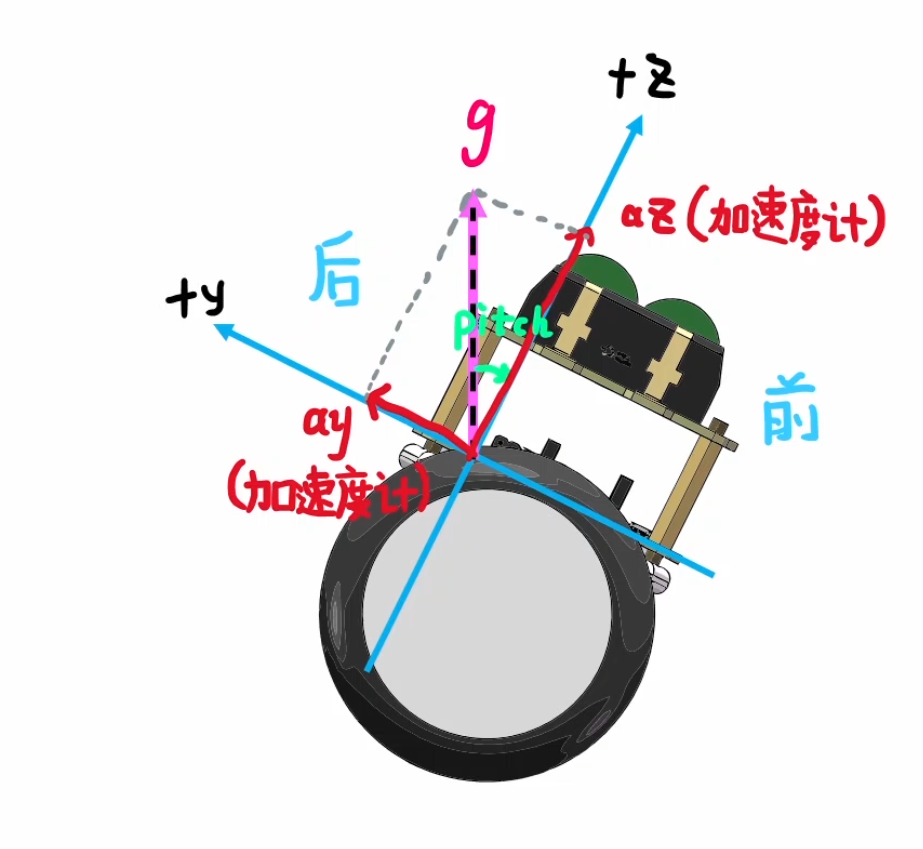
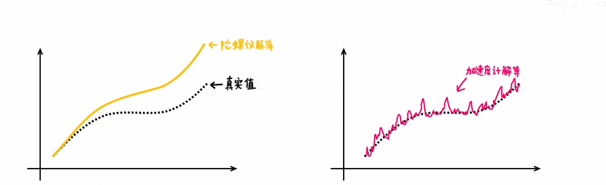

# 姿态解算

## 一、欧拉角

- **yaw：偏航角**

  相对于航向发生偏转的角，以z为轴

- **pitch：俯仰角**

  抬头偏转的角，以y为轴（或x）

- **roll：横滚角**

  横向翻滚的脚，以x为轴（或y）

#### 1. 陀螺仪解算欧拉角

根据现在的角度和陀螺仪角速度，积分得出$\Delta t$秒后新角度。

$$yaw[k]=yaw[k-1]+gz*\Delta t $$

$$pitch[k]=pitch[k-1]+gx*\Delta t $$

$$roll[k]=roll[k-1]-gy*\Delta t $$

$\Delta t$相当于采样频率，越小越精确。

陀螺仪存在漂移的问题，即使静止不动也会有小的偏差。

#### 2. 加速度计解算欧拉角

以重力方向为参考，根据重力与三轴的关系解算欧拉角。

$tan(pitch) = \frac{ay}{az}$

$pitch = arctan(\frac{ay}{az})$

注意到$arctan$取值是$(-\frac{\pi}{2}, \frac{\pi}{2})$，所以实际用到$pitch=arctan2(\frac{ay}{az})$

> acrtan2考虑了ay，az的正负号，范围在$(-\pi,\pi)$

同理，$tan(roll) = \frac{ax}{az}$， $roll= arctan2(\frac{ax}{az})$。

在飞行器运动过程中，由于惯性等因素，还会给加速度计带来噪声。

#### 3. 互补滤波

陀螺仪存在漂移的问题，加速度计存在噪声的问题。

陀螺仪使用递推的方式计算欧拉角，所以解算的误差会累积，差距与真实值越来越大。加速度计解算由于噪声问题，解算图像会产生许多毛刺。

互补滤波计算：

$$yaw = \alpha * yaw_g + (1-\alpha) * yaw_a$$

$$pitch = \alpha * pitch_g + (1-\alpha) * pitch_a$$

$$roll = \alpha * roll_g + (1-\alpha) * roll_a$$

> g陀螺仪，a加速度计

通过控制$\alpha$的值调整曲线。$\alpha$值越大，就越倾向于采信陀螺仪的数据，反之则倾向于采信加速度计的数据。
